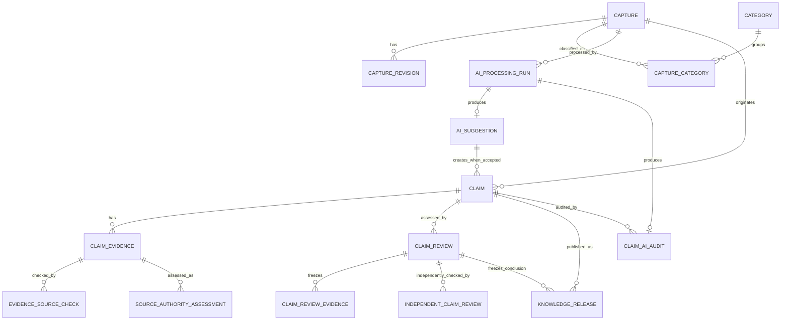

# 领域模型

## 1. 当前模块

```text
Capture        原始记录、修订和归档
Classification 内容类型、Category 及关联
AIProcessing   AI 运行记录、结构化建议和用户决策
ClaimReview    候选主张、证据及人工审核状态
KnowledgeRead  统一检索和主题档案只读投影
```

身份、成员和 Workspace 已从当前模型移除。整个部署实例只有一个共享数据域。

`KnowledgeRead` 不拥有事实表，也没有独立状态机。它从上述聚合根读取有界结果，保留实体类型、当前状态、Category 和 Capture 回链；任何检索命中都不能提升内容的可靠性等级。

## 2. Capture

Capture 表示用户写入系统的原始内容及当前版本。

职责：

- 保存标题、正文和内容类型。
- 保存自由文本描述对象和内容发生时间。
- 保留版本号。
- 编辑正文前创建 Revision。
- 控制 active/archived 状态。
- 作为所有 AI Run 的稳定来源。

Capture 不负责：

- 证明内容真实。
- 代表正式知识。
- 保存模型对原文的替代版本。

状态：

```text
active ──archive──> archived
archived ──restore──> active
```

## 3. Revision

Revision 是正文编辑前的不可变快照，至少保存：

```text
capture_id
version
title
subject
content
content_type
occurred_at
created_at
```

标题、正文或 Content Type 发生变化时必须生成 Revision 并增加 Capture 版本，包括接受 AI 标题/类型建议的情况。单独调整 Category 不产生 Revision；如果后续需要完整分类审计，再增加 Classification Event，而不是把 Category 数组塞进 Revision。

描述对象或发生时间发生变化时也创建 Revision。`occurred_at` 是内容中事件的时间，`created_at` 是写入 KnowTrace 的时间，两者不可混用。

## 4. Content Type

Content Type 是 Capture 的单值属性：

```text
keyword_set
thought_fragment
experience
observation
question
source_note
mixed
unknown
```

AI 可以建议 Content Type，但用户接受前不改变 Capture。

## 5. Category

Category 是用户创建的扁平主题分类。

职责：

- 提供稳定名称和标识。
- 支持 active/archived。
- 与 Capture 建立多对多关联。

MVP 不支持：

- 无限层级父子关系。
- Category 权限。
- 自动合并同义分类。
- 删除仍被 Capture 使用的 Category。

没有任何 Capture 关联的空 Category 可以永久删除。删除前必须在事务中重新统计关联，不能信任页面上的旧计数；归档状态不会放宽删除条件。

## 6. AIProcessingRun

每次模型调用创建一个独立 Run。

```text
running → succeeded
        → failed
        → cancelled
```

Run 绑定 Capture 的具体版本。重新处理创建新 Run，不覆盖旧记录。

`task_type=organize` 产生 AISuggestion；`task_type=claim_audit` 产生 ClaimAIAudit。两类任务共用状态、Provider、模型、耗时和错误审计，但输出实体不同。

## 7. AISuggestion

Suggestion 是通过 Schema 校验后的模型候选结果，可以包含：

- 建议标题。
- 摘要。
- 建议 Content Type。
- 已有 Category 候选。
- 新 Category 名称候选。
- 语义单元。
- 待补充问题。
- 质量警告。
- 最多 3 个可证伪主张候选。

状态：

```text
pending → accepted
        → modified
        → rejected
        → stale
accepted/modified → rolled_back
```

Suggestion 的首次决策不可重复覆盖。accepted/modified 可以进行一次受保护的整体回退：accepted payload 保存采纳前核心字段、采纳前后 AI 分类、应用后的 Capture 版本和本次新建 Claim ID；回退成功后状态变为 rolled_back，并记录结果版本。回退不是删除历史。

## 8. 关系



## 9. Claim 与 Evidence

Claim 是从指定 Capture 版本中人工接纳的可证伪陈述。AI 只能提出候选，不得直接创建已审核结论。Claim 保留原文片段、证伪条件和来源 Suggestion。

```text
candidate ──start──> investigating ──submit──> ready_for_review ──review──> concluded
                            ^                       │                         │
                            └──── return ───────────┴────── reopen ───────────┘

candidate / investigating / ready_for_review / concluded ──withdraw──> withdrawn
```

进入 `ready_for_review` 前至少需要一条 `accepted` Evidence。`ready_for_review` 只表示材料满足提交条件，不表示主张真实。当前没有 `verified` 状态。

Evidence 保存可选来源 URL、来源标题、逐字摘录、与主张的关系（支持/反驳/背景）以及审核状态。新证据默认为 `unreviewed`，只能在调查中由人工一次性决定为 `accepted` 或 `rejected`。调查中的未审核 Evidence 可以按版本编辑；编辑前创建不可变 EvidenceRevision，版本号递增，并清除当前来源检查投影，要求重新检查。来源 URL 留空时仍可记录 Evidence；至少有一张图片且附件人工核验通过后可以采纳。

EvidenceAttachment 是 Evidence 的图片附件。文件保存在单实例项目目录 `data/uploads/evidence`，数据库仅保存不可推测的相对文件名、原文件名、真实 MIME、字节数与 SHA-256。每条 Evidence 最多 5 张，单张最多 10 MB；已审核 Evidence 不再允许追加图片。附件可通过受控 API 在线查看。附件存在只说明文件已保存，不代表内容已经核验，也不自动改变 Evidence 审核状态；新增附件会使当前 `manual_attachment` 核验失效。

每次核验创建不可变 EvidenceSourceCheck，并以 `verification_method` 区分网页自动检查与附件人工核验。网页检查记录请求 URL、最终 URL、HTTP 状态、内容类型、内容哈希、页面标题、响应字节数、检查时间和摘录匹配结果；附件核验记录冻结附件清单、组合哈希、固定人工确认说明和核验时间。Evidence 保存当前检查投影；只有当前核验成功且摘录匹配时才能被采纳。核验结果不评价来源权威性，也不等于支持该 Claim。

ClaimReview 是一次不可变人工结论，使用 `supported / refuted / inconclusive`，保存依据、限制和审查序号。ClaimReviewEvidence 冻结该次结论使用的 Evidence、来源 URL、摘录、立场、SourceCheck ID、最终 URL、内容哈希与检查时间。重新调查后可以形成新结论，但不能覆盖旧结论。

ClaimAIAudit 是一次不可变 AI 辅助审查，保存当时的 Claim 时间、已确认采纳证据快照和证据指纹。它只表达覆盖、平衡、问题与待补检查，不是 ClaimReview，也不能改变 Claim 状态。当前输入与快照不一致时标记为 stale。

SourceAuthorityAssessment 是绑定 Evidence 版本的人工来源分级。IndependentClaimReview 保存由 go-user-system 服务端身份确认的第二审核者决定，同一身份不能覆盖同一结论版本。KnowledgeRelease 冻结主张、结论、证据哈希、来源权威性、独立复核和发布者；它是有界知识版本，不是 `verified=true`。

## 10. 不变量

1. Capture 的 `version` 从 1 开始；标题、正文或 Content Type 变化时递增，Category 变化不递增。
2. 同一 Capture 的 Revision 版本唯一。
3. 同一 Capture 与 Category 的关联唯一。
4. 归档 Category 不能新增关联。
5. 一个 succeeded Run 必须按 task type 产生通过 Schema 校验的 Suggestion 或 ClaimAIAudit。
6. 一个 failed Run 不得产生 Suggestion 或 ClaimAIAudit。
7. Suggestion 的 `source_capture_version` 永不改变。
8. AI 结果不得写入 Capture 正文。
9. Claim 必须绑定创建时的 Capture 版本和可定位的来源片段。
10. AI 候选默认不创建，单次最多人工接纳 3 个。
11. 没有已采纳 Evidence 的 Claim 不得进入 `ready_for_review`。
12. `ready_for_review` 不等于已验证或真实。
13. EvidenceSourceCheck 只追加、不覆盖；重复检查创建新快照；网络请求期间 Evidence 版本变化时不得写入旧检查结果。
14. 只有当前来源检查成功且摘录匹配的 Evidence 才能被 `accepted`。
15. `supported` 至少使用一条支持证据，`refuted` 至少使用一条反驳证据，`inconclusive` 至少使用一条已采纳证据。
16. ClaimReview 与 ClaimReviewEvidence 只追加；新审查使用递增版本号。
17. ClaimAIAudit 只追加，且不能写入 Claim、Evidence 或 ClaimReview。
18. AI Audit 的覆盖度、证据平衡、Evidence ID 和边界提示必须经服务端确定性校验。
19. Evidence 编辑必须使用乐观版本号并保留旧版本；已审核或不在调查中的 Evidence 不可编辑。
20. 图片必须同时通过声明 MIME、文件头、数量和大小检查；文件读取不得接受用户提供的路径。
21. 来源权威性评估只对绑定的 Evidence 版本有效，读取时不得沿用旧版本评估。
22. 结论作者不得作为该结论版本的独立复核批准者；认证关闭时不得满足职责分离门槛。
23. 发布至少需要两个独立来源、一个强来源、全部当前证据快照和无修改要求的独立批准。
24. KnowledgeRelease 只追加且快照哈希唯一；永久删除来源 Capture 时按用户删除语义级联清理。

## 11. 后续边界

当前可信发布使用独立模型：

```text
Capture → Candidate Claim → Evidence → ClaimReview
                                      ↓
                  SourceAuthority + IndependentReview
                                      ↓
                           KnowledgeRelease vN
```

当前已实现单实例中的网页来源检查、无链接图片附件人工核验、证据化人工结论、非裁决 AI 审查、身份化独立复核和不可变发布版本。尚未实现 Workspace 隔离、角色权限策略和跨组织审核队列；因此它仍不能被描述为面向公网或大型团队的可信发布平台。
