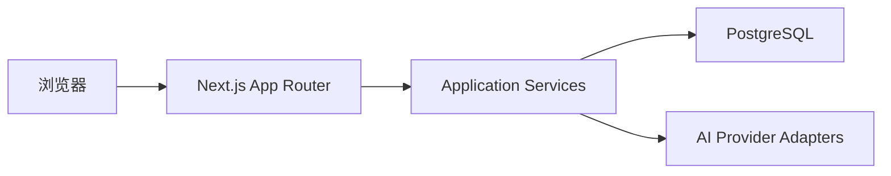

# 技术架构

## 1. 架构结论

首版采用单仓库、单 Next.js 应用、单 PostgreSQL 数据库。

截至本次文档更新，Next.js 16.2 是 Active LTS 系列；初始化时应选择 16.2 的最新安全补丁，而不是 16.3 Preview。后续升级通过独立变更完成，不能只因为“更新”就默认使用预览版。



## 2. 选择全栈 TypeScript 的原因

### 问题

首版功能集中在记录、分类、AI 调用和简单页面，如果同时维护独立前端和 Go/Python API，会产生重复 DTO、接口和部署工作。

### 修改建议

使用 Next.js App Router 直接完成 UI 和服务端能力，业务规则放入与框架隔离的 Application Service。需要 App 或独立后端时，再通过 Route Handler 或新服务复用/迁移这些规则。

### 取舍

优点：

- 更快形成可使用版本。
- 前后端共享 TypeScript 类型和 Zod Schema。
- 单容器应用加数据库即可部署。

代价：

- 当前项目不再以 Go 后端训练为主要目标。
- 必须防止 Server Action、组件和数据库查询互相耦合。
- 长任务不能依赖普通 Server Action 无限等待。

## 3. Next.js 数据模式

- 页面首次读取：Server Component 直接调用 Query Service。
- 表单和 UI 修改：Server Action 调用 Command Service。
- Client Component 只负责需要交互状态的局部区域。
- 健康检查、Webhook、未来 App API：Route Handler。
- 默认 Node.js Runtime；数据库和 AI SDK 不使用 Edge Runtime。
- 动态 `params`、`searchParams`、`cookies`、`headers` 按当前异步 API 使用。

## 4. 推荐目录

```text
src/
├── app/
│   ├── (capture)/
│   │   ├── page.tsx
│   │   ├── captures/[id]/page.tsx
│   │   └── categories/[id]/page.tsx
│   ├── api/health/live/route.ts
│   ├── api/health/ready/route.ts
│   ├── error.tsx
│   ├── global-error.tsx
│   └── layout.tsx
├── features/
│   ├── capture/
│   │   ├── actions.ts
│   │   ├── service.ts
│   │   ├── repository.ts
│   │   ├── schema.ts
│   │   └── components/
│   ├── classification/
│   └── ai-processing/
├── server/
│   ├── db/
│   ├── ai/
│   │   ├── provider.ts
│   │   ├── openai.ts
│   │   └── deepseek.ts
│   ├── config/
│   └── observability/
└── shared/
    ├── errors/
    └── validation/

drizzle/
tests/
docs/
```

## 5. 依赖方向

```text
Page / Component
→ Server Action / Query
→ Application Service
→ Repository / Provider Port
→ Drizzle / Vendor SDK
```

禁止：

- Client Component 导入数据库模块。
- React 组件直接执行 Drizzle 查询。
- Server Action 保存供应商 SDK 原始对象。
- Provider Adapter 更新 Capture。
- Repository 返回 Next.js Response。

## 6. AI 调用模式

P0 采用“主动触发、请求内等待、持久化 Run”的简单模式：

```text
创建 running Run
→ 带超时调用 Provider
→ 校验输出
→ 保存 Suggestion
→ 更新 Run
```

以下任一条件出现后迁移到 Worker：

- 模型调用经常超过平台请求时限。
- 需要自动重试或批量处理。
- AI 处理影响页面请求容量。
- 部署平台不保证长请求稳定执行。

## 7. 配置

服务端环境变量：

```text
DATABASE_URL
AI_DEFAULT_PROVIDER
OPENAI_API_KEY
OPENAI_MODEL
OPENAI_BASE_URL
DEEPSEEK_API_KEY
DEEPSEEK_MODEL
DEEPSEEK_BASE_URL
AI_REQUEST_TIMEOUT_MS
AI_MAX_INPUT_CHARS
```

Provider Base URL 使用代码内受控默认值或服务端白名单。浏览器只可为 OpenAI 的 CC-Switch 模式传入 `localhost`、回环地址或 `host.docker.internal`，服务端规范化为 `/v1`；其他任意 URL 均拒绝。

UI 提供的 API Key 通过 Server Action 仅传入本次 Provider 调用，不参与输入哈希，不写入数据库、Run、Suggestion 或日志。用户可选择把凭据保存在当前标签页的 `sessionStorage`，默认不保存。

## 8. 部署

Docker 自托管使用 Next.js standalone output：

```js
const nextConfig = {
  output: 'standalone',
}
```

Compose 服务：

```text
app
postgres
```

首版单实例，不引入 Redis、消息队列和共享 ISR Cache。页面以动态数据读取为主，避免为简单内部工具增加复杂缓存一致性问题。

## 9. GitHub 项目复用策略

开始编码前可以检查用户现有 GitHub 仓库，但必须先做适配评估：

- 是否已经使用 Next.js App Router。
- 依赖是否仍受支持并无已知严重安全问题。
- 数据模型是否能容纳 Capture、Category 和 AI Run。
- 是否带有难以删除的认证、租户或 SaaS 计费耦合。
- 测试和迁移是否可靠。

优先复用基础 UI、编辑器、数据库配置和部署脚本；不为了“不是从零开始”而继承不匹配的业务模型。
