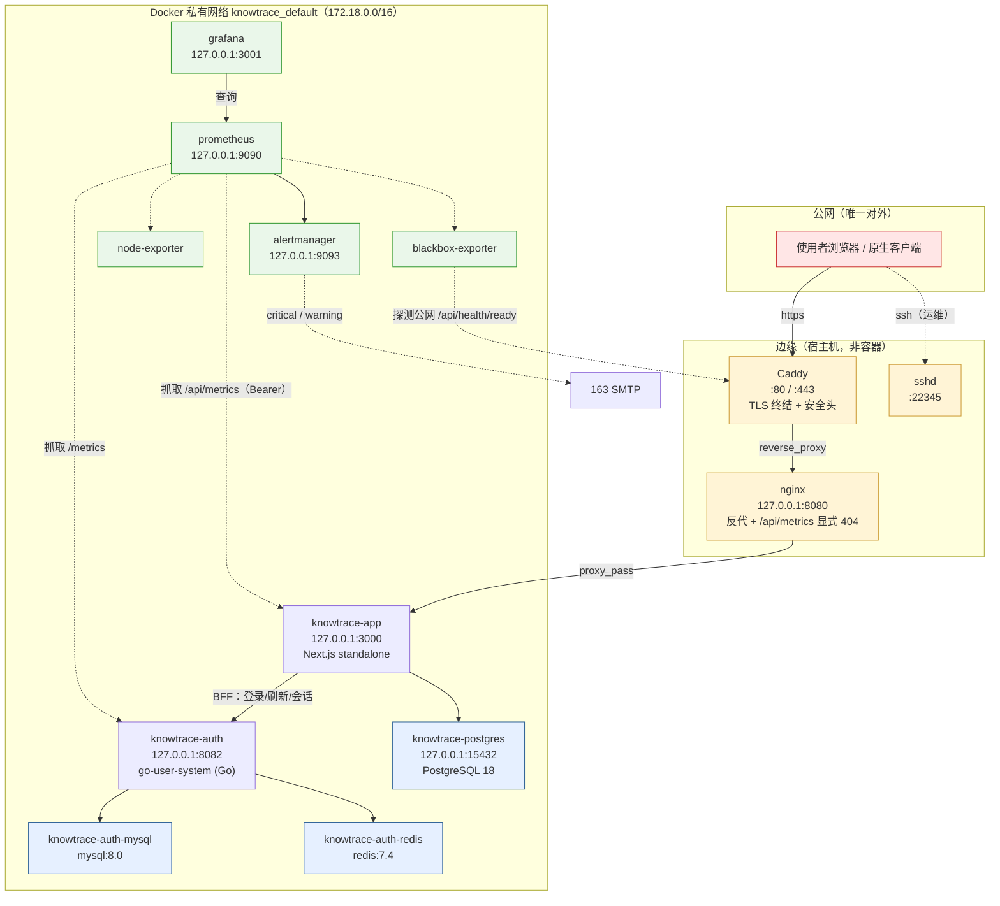
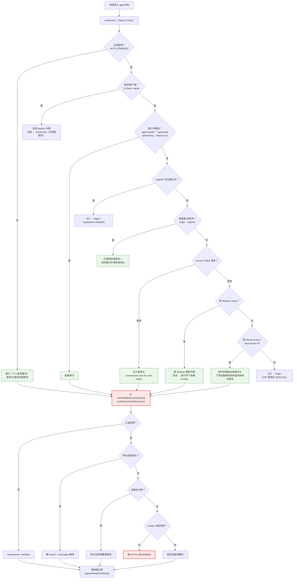
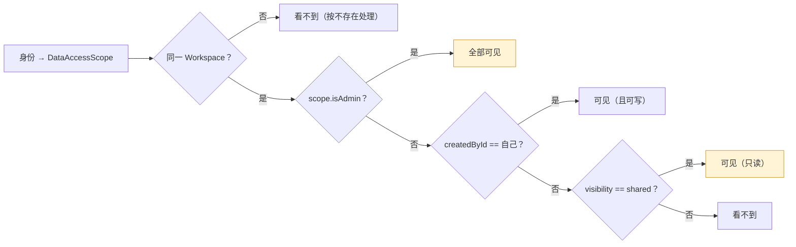
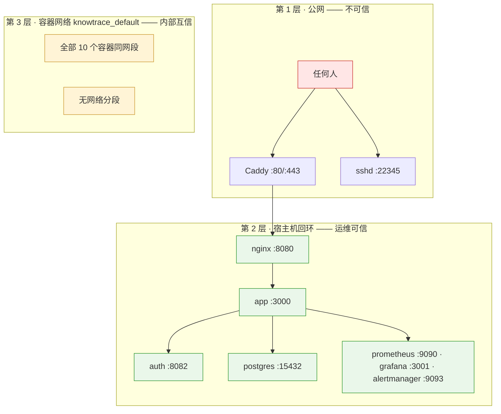
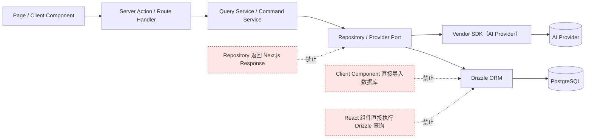

# 技术架构图

| 项 | 值 |
| --- | --- |
| 建立时间 | 2026-10-02 |
| 用途 | 补齐 `docs/06-architecture.md` 里那张 5 行流程图**覆盖不到**的整体结构 |
| 与 `docs/06` 的关系 | **不替代它**。`docs/06` 讲的是「为什么这样选」（取舍与理由），本文画的是「实际长什么样」（组件、链路、边界） |
| 领域模型 | 见 [`03-domain-model.md`](03-domain-model.md) 的 `erDiagram`，本文不重复 |
| 证据纪律 | 图里每个组件都能在服务器 `docker ps` 找到；端口与链路与 `ss -tlnp` / Caddyfile / nginx conf 一致 |

---

## 1. 部署拓扑

**读这张图要抓住三件事**：

| # | 事实 | 为什么重要 |
| --- | --- | --- |
| 1 | **只有 Caddy（80/443）与 sshd（22345）对外** | 其余全部绑 `127.0.0.1`；数据库没有对公网开放 |
| 2 | **代理是三跳**：Caddy → nginx → app | `docs/06` 的旧图完全没有这一层；限流的真实 IP 就在这条链上传递 |
| 3 | **10 个容器全在同一网络，没有分段** | 见第 4 节的边界说明——这是**已知的收敛点**，不是疏忽 |

---

## 2. 一次请求的鉴权链路（**安全关键路径**）

**这张图是本文最有价值的一张**，因为它画出了一个**容易误解的事实**：

> **Proxy 不是安全边界，`currentDataAccessScope()` 才是。**

Proxy 做的是**页面前置门禁**（决定「给不给看这个页面」）；
真正的**数据授权**在每个查询里通过 `captureReadCondition(scope)` 执行。所以：

- **Proxy 放行了不等于有权限**——`STRIP` 那条路径就是例子：
  它故意放行 Server Action，但剥掉身份头，让下游**自己**判断并返回结构化错误。
- **新加一个查询而忘记带 `captureReadCondition`，没有任何东西会拦住它**——
  这是当前鉴权模型的**单点风险**（见第 7 节）。

---

## 3. 数据可见性规则（谁看得到什么）

**这张图解释了 2026-10-01 那次数据暴露事故**——不是某一条规则错了，是**三条规则叠加**：

1. 新用户自动进默认空间（`ensureLegacyWorkspaceMembership`）
2. 成员可读 `shared`（上图「可见（只读）」那条）
3. **管理员的 `private` 会被 `applyAdminSharingPolicy` 强制改回 `shared`**

⇒ **任何注册者必然能读到管理员的全部记录。** 所以「关闭注册」是唯一的零代码缓解。

---

## 4. 信任边界（三层，可信度不同）

**第 3 层的边界要写清楚**（这是已知的收敛点，不是疏忽）：

| 事实 | 影响 |
| --- | --- |
| 10 个容器同网段、**无分段** | 应用容器能直连数据库容器；监控容器也能 |
| 认证服务的 `trustedProxies` 设为 `172.18.0.0/16` | 该网络内**任何容器**都能伪造 `X-Forwarded-For` 绕过 IP 维度限流 |
| 已接受的理由 | 网络内无外部方；**账号维度限流（5 次）仍然生效** |

**若将来要收紧**：把数据库与观测栈拆到独立网络，只让 app 能到 postgres、
只让 prometheus 能到各 exporter。**那是基础设施改动，需要单独规划。**

---

## 5. 代码分层与依赖方向

`docs/06` 第 5 节已给出依赖方向与禁止项，此处只把它画出来：

实际落地时，业务规则集中在 **`src/features/*/service.ts`（10 个）**，
而不是 `docs/06` 早期规划里写的根级 `services/`——那里现在只有
subtree 引入的 Go 认证服务。**这一点正是 `AGENTS.md` 曾经写错的地方。**

---

## 6. 与 `docs/06` 的关系

| 文档 | 回答 |
| --- | --- |
| [`06-architecture.md`](06-architecture.md) | **为什么这样选**——取舍、理由、被否掉的方案 |
| **本文** | **实际长什么样**——组件、链路、边界、可见性 |

**`docs/06` 的 5 行流程图保留不动**（它是「架构结论」的一句话表达）；
本文是它的**展开与校正**——补上边缘代理、监控栈、Workspace 隔离，
并更正第 8 节「KnowTrace Compose 服务：app、postgres」的过时描述
（**实际 10 个容器**）。

---

## 7. 维护约定

**改以下任何一处时，回来更新对应的图**：

| 改动 | 更新哪张图 |
| --- | --- |
| 加/删容器、改端口映射 | 第 1 节 部署拓扑 |
| 改 `src/proxy.ts` 的分支 | 第 2 节 鉴权链路 |
| 改 `resource-scope.ts` 或 `applyAdminSharingPolicy` | 第 3 节 可见性规则 |
| 拆网络分段、改 `trustedProxies` | 第 4 节 信任边界 |
| 改服务层分层或依赖方向 | 第 5 节 分层 |

**这五处恰好也是本季度改动最密集的地方**——所以这张图的价值不在于「画得全」，
而在于**它是这几条链路的单一参照**，不必每次去代码里重新挖一遍。

### 一张表：图与已知缺口的对应

| 图 | 对应哪些已知问题 |
| --- | --- |
| 第 2 节 鉴权链路 | 2026-10-01 修的「会话续期从不触发」就发生在 `P5 → RENEW` 那条边 |
| 第 3 节 可见性规则 | 2026-10-01 的数据暴露事故 |
| 第 4 节 信任边界 | 2026-10-01 修的「限流按容器 IP 计数」——`trustedProxies` 那一行 |

**三张图各自对应一次真实事故。** 这不是巧合：
**改动最密集的地方，就是最容易画错、也最需要有一张共同参照的地方。**
