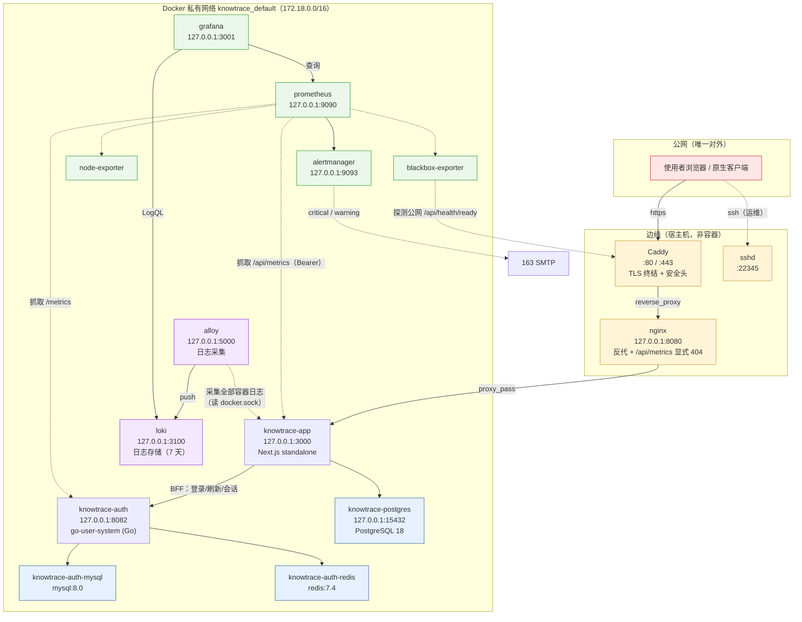
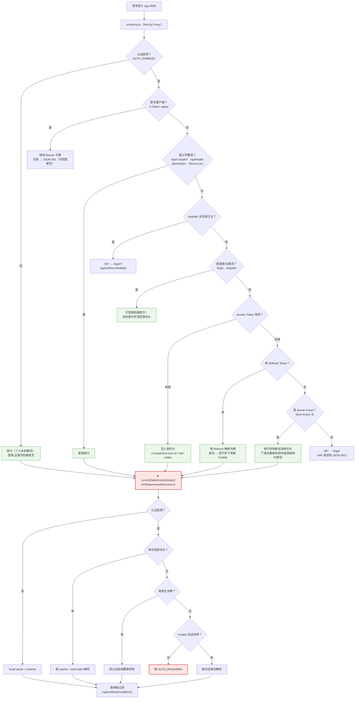
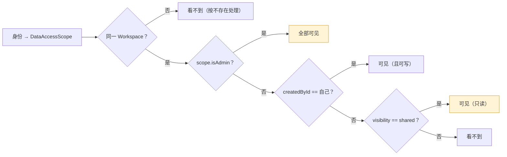
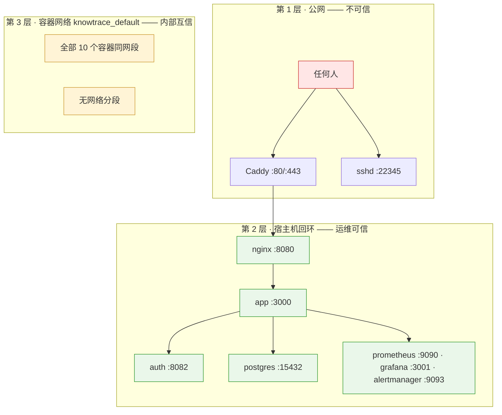
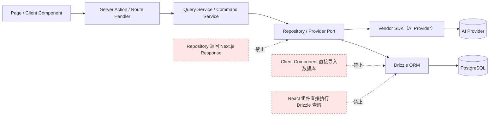
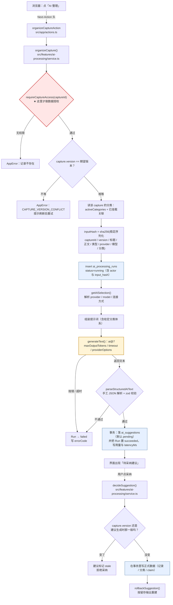
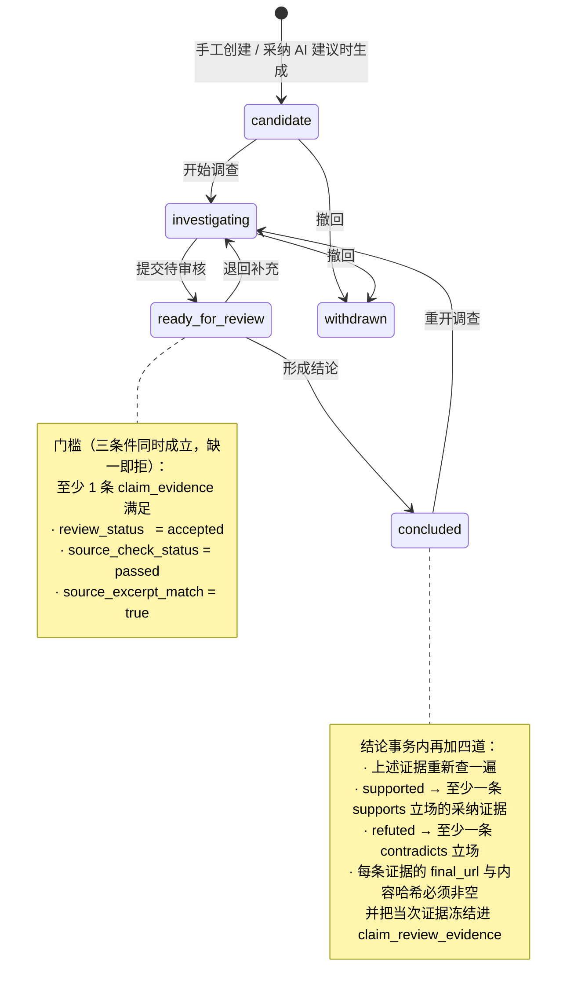
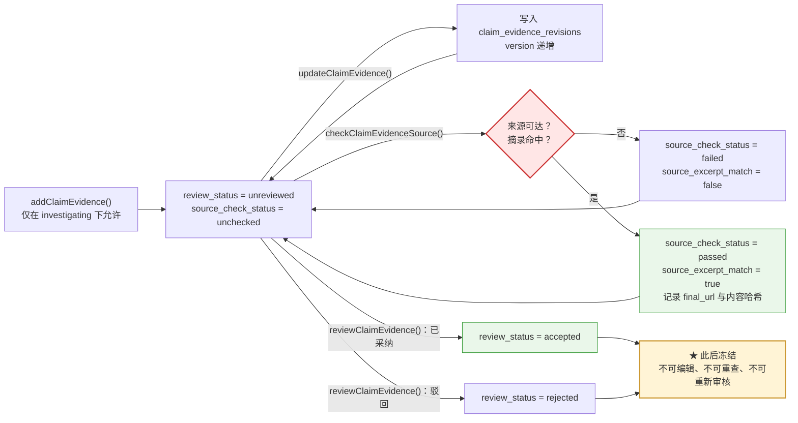
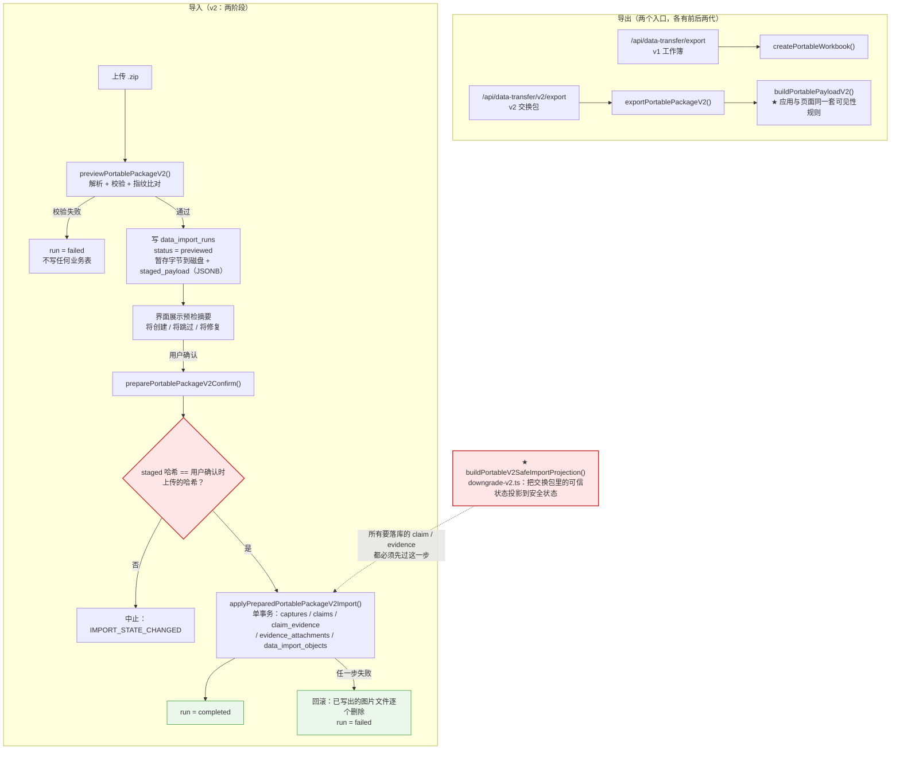
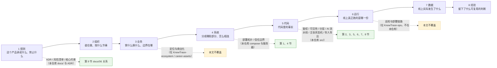

# 技术架构图

| 项 | 值 |
| --- | --- |
| 建立时间 | 2026-10-02 |
| 用途 | 补齐 `docs/06-architecture.md` 里那张 5 行流程图**覆盖不到**的整体结构（**9 节共 10 张图**：部署 / 鉴权 / 可见性 / 边界 / 分层 / AI 流水线 / **主张状态机（2 张）** / **导入导出** / 生态链路） |
| 与 `docs/06` 的关系 | **不替代它**。`docs/06` 讲的是「为什么这样选」（取舍与理由），本文画的是「实际长什么样」（组件、链路、边界） |
| 领域模型 | 见 [`03-domain-model.md`](03-domain-model.md) 的 `erDiagram`，本文不重复 |
| 证据纪律 | 图里每个组件都能在服务器 `docker ps` 找到；端口与链路与 `ss -tlnp` / Caddyfile / nginx conf 一致。**本节标注了两类证据：站上实测【实测】，与引自 `KnowTrace-ecosystem` 的数字（已在第 11 节注明来源）** |

---

## 1. 部署拓扑

**读这张图要抓住三件事**：

| # | 事实 | 为什么重要 |
| --- | --- | --- |
| 1 | **只有 Caddy（80/443）与 sshd（22345）对外** | 其余全部绑 `127.0.0.1`；数据库没有对公网开放 |
| 2 | **代理是三跳**：Caddy → nginx → app | `docs/06` 的旧图完全没有这一层；限流的真实 IP 就在这条链上传递 |
| 3 | **12 个容器全在同一个网络、完全没有分段** | 见第 4 节——这是**已知的收敛点**，不是疏忽。2026-10-03 换掉 ELK 后，连仅有的那两个独立网络也没了 |

---

## 2. 一次请求的鉴权链路（**安全关键路径**）

**这张图的价值在于画出了一个容易误解的事实**：

> **Proxy 不是安全边界，`currentDataAccessScope()` 才是。**

Proxy 做的是**页面前置门禁**（决定「给不给看这个页面」）；
真正的**数据授权**在每个查询里通过 `captureReadCondition(scope)` 执行。所以：

- **Proxy 放行了不等于有权限**——`STRIP` 那条路径就是例子：
  它故意放行 Server Action，但剥掉身份头，让下游**自己**判断并返回结构化错误。
- **新加一个查询而忘记带 `captureReadCondition`，没有任何东西会拦住它**——
  这是当前鉴权模型的**单点风险**（见第 10 节）。

---

## 3. 数据可见性规则（谁看得到什么）

**这张图解释了 2026-10-01 那次数据暴露事故**——不是某一条规则错了，是**三条规则叠加**：

1. 新用户自动进默认空间（`ensureLegacyWorkspaceMembership`）
2. 成员可读 `shared`（上图「可见（只读）」那条）
3. **管理员的 `private` 会被 `applyAdminSharingPolicy` 强制改回 `shared`**

⇒ **任何注册者必然能读到管理员的全部记录。** 所以「关闭注册」是唯一的零代码缓解。

---

## 4. 信任边界（三层，可信度不同）

**这张图的重点是：信任不是按网络位置划分的，是按「谁能访问」划分的。**

| 层 | 谁在里面 | 可信度怎么来的 | 实测结论 |
| --- | --- | --- | --- |
| 公网 | 任何人 | 无 | 只有 Caddy（80/443）与 sshd（22345）在监听；数据库不对公网开放 |
| 宿主机回环 | nginx / app / auth / postgres / 观测与日志组件 | **运营商（运维）可信**，不是「本机即可信」 | 非公网端口全部绑 `127.0.0.1`，因此**必须走 SSH 隧道** |
| 容器网络 | **12 个**容器全在 `172.18.0.0/16` | **内部互信**（当前设计） | 见下面三个实测事实 |

**三个实测事实**（可逐条验证，不是推断）：

| 事实 | 实测 | 影响 |
| --- | --- | --- |
| 主网络**完全没有分段** | 12 个容器全部只在 `knowtrace_default`；`docker network ls` 只剩 `bridge`/`host`/`none` | 应用容器能直连 `postgres`、`auth-mysql`、`auth-redis`；**新增的 Loki/Alloy 也在同一网段内** |
| 认证服务信任整个网段 | `.env` 的 `AUTH_TRUSTED_PROXIES=172.18.0.0/16` | **该网段内任何容器**都能伪造 `X-Forwarded-For`；而 app 又原样转发收到的 XFF，两者叠加即可绕过 **IP 维度**限流 |
| **但能利用的只有应用容器自身** | 认证服务容器**只接** `knowtrace_default` | 「app 转发伪造 XFF 给 auth」这条路径**到得了**，但前提是 app 已被攻破；账号维度限流（5 次）也仍然生效 |

**还有两个容易被说错的点，一并写在这里**：

1. **nginx 的守卫是有效的，而且是「覆盖」语义**：Caddy 先用
   `real_ip_header X-Forwarded-For` + `real_ip_recursive on` 把 `$remote_addr` 还原成真实客户端；
   nginx 再 `proxy_set_header X-Forwarded-For $remote_addr` —— **覆盖**，不是追加。
   外部伪造的 XFF 到不了下游。（`deploy/nginx/knowtrace-vps.conf`）
2. ⚠️ **2026-10-03 换掉 ELK 之后，仅有的那点网络分段也消失了 —— 这是一次实测到的边界弱化。**
   原先 ELK 是唯一声明自定义网络的服务（`knowtrace_logging-internal` `172.19.0.0/16`
   `internal: true` + `knowtrace_logging-management` `172.20.0.0/16`，都不在 app 的
   `172.18.0.0/16` 内）。ELK 删除、Loki/Alloy 接替后它们没有使用者，两个网络一并删除，
   两个新容器直接进默认网络。
   **直接后果**：Loki 与 Alloy 现在都落在 `AUTH_TRUSTED_PROXIES=172.18.0.0/16` 之内。
   Alloy 只读挂载了 `/var/run/docker.sock` 并监听 `127.0.0.1:5000`（回环，未对外），
   Loki 监听 `127.0.0.1:3100`；按上面「谁能访问」的判据它们仍属**第 2 层**。
   但"在网段内"这个事实本身是新的，和上面第 2 条（网段内可伪造 XFF）叠加时应当一起考虑。

**若将来要收紧**：把数据库与观测/日志栈拆到独立网络，只让 app 能到 postgres、
只让 prometheus 能到各 exporter、只让 alloy 能到 loki，并相应收窄
`AUTH_TRUSTED_PROXIES`。**那是基础设施改动，需要单独规划**；
换 ELK→PLG 时已把这件事作为已知代价记在这里，不是遗漏。

---

## 5. 代码分层与依赖方向

`docs/06` 第 5 节已给出依赖方向与禁止项，此处只把它画出来：

实际落地时，业务规则集中在 **`src/features/*/service.ts`（10 个）**，
而不是 `docs/06` 早期规划里写的根级 `services/`——那里现在只有
subtree 引入的 Go 认证服务。**这一点正是 `AGENTS.md` 曾经写错的地方。**

---

## 6. AI 整理流水线（一次真实写入的链路）

前五张图里，第 5 张只有 8 个方块。**而线上一次「AI 整理」实际发生的事**——
包括每一步的成功与失败路径——是下面这样。这一节是那张图的展开与校正。

**读这张图要抓住五件事**：

| # | 事实 | 依据 |
| --- | --- | --- |
| 1 | **`organizeCapture` 第一步就是 `requireCaptureAccess`** | `service.ts` 方法体第一行 |
| 2 | **`inputHash` 是只写不读的**：算出来、写进 Run 行，**没有任何地方查它**；表上也没有唯一索引 | `grep inputHash` 只有计算与插入两处；`ai_processing_runs` 无 `uniqueIndex` |
| 3 | **模型调用的信任度低于代码**：`generateText` 拿到的是**文本**，靠 `parseStructuredAIText` 手工解析 JSON 再过 zod | `src/server/ai/provider.ts`；不是 `generateObject` |
| 4 | **AI 从不直接写正式数据**，只产出 `pending` 建议；采纳是第二次独立鉴权 | `decideSuggestion` 先 `requireSuggestionAccess` |
| 5 | **采纳前比对的是 `capture.version`**（不是 `inputHash`）：等待期间记录被改过，建议判 `stale` 并拒绝 | `suggestion.sourceCaptureVersion` 与 `capture.version` 对比 |

其中第 2 条是这张图最先暴露出来的：**「整理两次」不会复用任何东西**。
点两次 = 两条 Run + 两条建议。（这正是 6.1 里「没有幂等」那一条的真实成本。）

### 6.1 这张图对应的四个真实缺口

它不是「画得全」，而是**把四个已经发生或已识别的缺口标在了位置上**：

| 位置 | 缺口 | 依据 |
| --- | --- | --- |
| `SA → SVC` 之间 | **界面没有等待反馈**。7–20 秒的等待没有进度提示，诱导用户重复点击 | [`19-product-defect-inventory.md`](19-product-defect-inventory.md) D-02 残余问题 |
| `HASH` 这一行 | **没有幂等**：`inputHash` 只写不读、无唯一索引，重复点击必然产生重复 Run 与重复建议 | 上图第 2 条 |
| `RUN` 这一行 | **触发端点已经有了，但和 Server Action 走同一条同步阻塞路径**：`POST /api/v1/ai-runs`（2026-09-30 加入）内部直接 `await organizeCapture`，路由注释自己写着「不要因为等待而重复提交」。**缺的是队列与异步轮询** | `src/app/api/v1/ai-runs/route.ts`；`docs/19` 的 D-02 未回改，那句「没有触发端点」已过时 |
| 图外 | **`status=running` 的残留 Run 一直在**。`AI_RUNNING_STALE_AFTER_MS` 只被 `scripts/maintenance.mjs`（`npm run db:maintenance`）读取，而**没有对应的 systemd timer** | 服务器 `systemctl list-timers` 无此单元 |

**这四条都不是「图画错了」，是「图画对了才发现的位置」。**

---

## 7. 主张的证据状态机（**信任的关键路径**）

第 3 节回答了「谁能看」，第 6 节回答了「AI 怎么产出建议」。
**这一节回答的是这个产品真正的差异化问题：一条主张凭什么算「成立」。**

**状态机的守卫是分层的**——这是最容易记错的地方：

| 层 | 谁执行 | 拦掉什么 |
| --- | --- | --- |
| **允许的迁移** | `canTransitionClaim()`（`claims/state.ts`，纯函数） | 不存在的边，例如 `candidate → concluded` |
| **乐观锁** | `claims.status == expectedStatus` | 并发改动（两个标签页同时操作） |
| **提交门槛** | `transitionClaim` → `ready_for_review` 前的计数查询 | 没有合格证据就提交 |
| **采纳门槛** | `reviewClaimEvidence()` | 来源未确认就把证据标成「已采纳」 |
| **结论门槛** | `concludeClaim()` 事务内**重查**一遍证据 + 评估立场匹配 | 结论与证据立场不符 |

### 7.1 证据自己的一条小状态机

证据不是「一条记录」，它有版本、有来源检查、有审核。**关键是「审核即终局」**：

**三条实测事实**：

1. **编辑、查来源、审核三件事的守卫完全一样**——都要求 `claimStatus == investigating`
   且 `reviewStatus == unreviewed`。所以这三个动作可以在同一状态下**反复做**（至少对来源检查而言）。
2. **审核是终局，且不可翻案**：全仓库**只有一处**写 `reviewStatus`
   （`reviewClaimEvidence` 里的 `unreviewed → accepted | rejected`），
   **没有任何路径把它改回 `unreviewed`**。一条被驳回的证据不会被「重开」，
   只能**新增一条证据**。（`concluded → investigating → 再提交` 也救不回来，
   因为那时证据早已离开 `unreviewed`。）
3. **来源检查只写「材料」，不写「结论」**：它改的是
   `source_check_status` 与 `source_excerpt_match`，**不碰 `review_status`**。
   来源查过了，不等于被采纳。

### 7.2 结论之后：**发布**才是真正的收口（八道检查）

`concludeClaim()` 只是把一条主张变成「已成结论」。**能不能发布成一份可被引用的知识版本，
是另一套、更严的门槛**——`evaluateReleaseReadiness()` 的八项，**全过才 `readyToPublish`**：

| # | 检查码 | 要求 |
| --- | --- | --- |
| 1 | `authenticated` | 已启用认证并能识别发布者 |
| 2 | `concluded` | 主张已是 `concluded` 且有当前人工结论 |
| 3 | `evidence_count` | 结论**至少冻结 2 条**证据快照 |
| 4 | `evidence_current` | 全部证据仍为已采纳、来源检查通过、**且当前来源检查就是冻结时那一次** |
| 5 | `authority` | 每条证据都有当前版本的来源权威性评估（等级非 `unknown`） |
| 6 | `strong_authority` | 至少一条来源是**第一手 / 官方 / 专业** |
| 7 | `independent_sources` | 证据来自**至少 2 个独立发布主体**（按 final_url 的域名归一化） |
| 8 | `independent_review` | **不是结论作者**的登录用户批准了独立复核，且没有未解决的修改要求 |

**第 6、7、8 三条才是这个产品「更好的证据」主张的真正实现处**——
它们把「权威、独立、可复核」从口号变成了可判定的布尔值。

### 7.3 这条链上唯一「只写不读」的表

| 表 | 谁写 | 进门槛了吗 |
| --- | --- | --- |
| `claim_review_evidence` | `concludeClaim()` 事务内冻结 | ✅ 结论的组成部分 |
| `source_authority_assessments` | `assessSourceAuthority()` | ✅ 检查 5、6 |
| `independent_claim_reviews` | `submitIndependentReview()` | ✅ 检查 8（并按 `inputHash` 判过期） |
| `knowledge_releases` | `publishReliableKnowledge()` | ✅ 就是发布物本身 |
| `claim_ai_audits` | `auditClaim()`（AI 审计主张） | ❌ **只在记录详情页展示，不进任何门槛** |

**`claim_ai_audits` 与第 6 节的 `inputHash` 是同一个形状**：写进去、能读出来、但不参与任何判定。
（区别是 `inputHash` 连读都没有。）

### 7.4 两处缺口

| 位置 | 缺口 |
| --- | --- |
| `publishReliableKnowledge` | **只有 Web 端 Server Action 入口**（`publishReliableKnowledgeAction`），`/api/v1` 没有发布端点 → 移动端**只能看不能发布**。与 D-02 的「移动端走不通」同一形状 |
| 结论 → 发布之间 | **没有图**。`topic-synthesis` 读的是 `claim_reviews`（结论），不读 `knowledge_releases`；主题档案与已发布知识版本**各走各的**，二者没有图也没有交叉引用 |

> **本文到 `knowledge_releases` 为止。**「发布 → 检索 / 主题档案 → 用户看到」这一段
> 跨 `topic-synthesis` 与 `search` 两个模块，是下一张该补的图。

---

---

## 8. 数据导入导出（v2）：最重的一块，也是唯一自带降级的一块

`data-transfer` 有 **5694 行**——**全仓库最大的模块，占 `src/` 的 20%**。
前七张图里它一次都没出现过。这一节补上。

### 8.1 最值得记住的一条：**导入包里的「可信状态」一律不被采信**

交换包里带着 `originalStatus`、`originalReviewStatus`、`originalSourceCheckStatus`——
供人阅读迁移过来的调查过程（工作簿里这些格子**可编辑**，因此**不构成完整性边界**）。
落库时**必须**换成投影后的安全值：

| 字段 | 包里的原值 | **导入后落库的值** |
| --- | --- | --- |
| claim.status | 任意（含 `concluded`） | `candidate` / `investigating` / `withdrawn` 三者之一 |
| claim.sourceCaptureVersion | 原版本号 | **本地当前版本** |
| evidence.version | 原版本号 | **1** |
| evidence.reviewStatus | 任意（含 `accepted`） | **`unreviewed`** |
| evidence.sourceCheckStatus | 任意（含 `passed`） | **`unchecked`** |
| evidence.sourceExcerptMatch | 任意 | **`null`** |

这六行意味着：**从别的实例导入的「已形成结论」的主张，在你的实例里必须重新走一遍调查。**
`downgrade-v2.ts` 顶部的注释把理由写得很清楚——工作簿是给人看的，不是信任边界。
**这是整个仓库里语义最重的一段代码**，值得单独一张图。

### 8.2 三道跨「预检 → 确认」之间的一致性检查

预检与确认之间可能隔几分钟（用户在看摘要），期间本地数据会变。三道检查都拦这个：

| # | 检查 | 失败时 |
| --- | --- | --- |
| 1 | 暂存字节的 SHA-256 == 确认时重新读到的字节 | `IMPORT_STATE_CHANGED` |
| 2 | `staged_payload` 与用户确认时解析出的 payload 逐字节一致（`portableV2ConfirmationSnapshotMatches`） | 同上 |
| 3 | 每张图片：本地文件存在、字节数与 SHA-256 都与包内一致 | `IMPORT_ATTACHMENT_LOCAL_FILE_INVALID` |

**第 2 条的意义**：预检摘要展示的和确认导入的**必须是同一份内容**，
否则用户是在对一个自己没看过的包点「确认」。

### 8.3 两处实测事实

1. **v2 的幂等靠一张归属表，不靠 `importFingerprint`**：v1 用 `captures.import_fingerprint`
   （有带条件唯一索引 `..._import_fingerprint_uq`）；**v2 完全不用它**，
   改由 `data_import_objects` 的
   `(workspaceId, actorId, formatVersion, objectType, sourceKey)` **唯一索引**判定
   每个对象的归属，并区分「将创建 / 将修复 / 将跳过」。
2. **主张冲突有两层**：`claims_statement_hash_uq` 是**全局**唯一索引
   （只按 `statementHash`，不按 workspace 或创建者）。v2 在插入前先做一次**预检**，
   命中就报可读的 `IMPORT_CLAIM_LOCAL_CONFLICT`；索引只是兜底。

### 8.4 一处缺口

**v1 与 v2 两套端点都在、都可达**（`data-transfer-panel.tsx` 同时挂着 `/export` 与 `/v2/export`）。
服务层 `service.ts` 与 `service-v2.ts` 并存，**没有任何地方标注 v1 是否已废弃**。
两条导出路径、两条导入路径、两套契约（`contracts.ts` / `contracts-v2.ts`）——
**读代码的人无法从代码本身判断该改哪一套。**

---
---

## 9. 与 `docs/06` 的关系

| 文档 | 回答 |
| --- | --- |
| [`06-architecture.md`](06-architecture.md) | **为什么这样选**——取舍、理由、被否掉的方案 |
| **本文** | **实际长什么样**——组件、链路、边界、可见性 |

**`docs/06` 的 5 行流程图保留不动**（它是「架构结论」的一句话表达）；
本文是它的**展开与校正**——补上边缘代理、监控栈、Workspace 隔离，
并更正第 8 节「KnowTrace Compose 服务：app、postgres」的过时描述
（**实际 10 个容器**）。

---

## 10. 维护约定

**改以下任何一处时，回来更新对应的图**：

| 改动 | 更新哪张图 |
| --- | --- |
| 加/删容器、改端口映射 | 第 1 节 部署拓扑 |
| 改 `src/proxy.ts` 的分支 | 第 2 节 鉴权链路 |
| 改 `resource-scope.ts` 或 `applyAdminSharingPolicy` | 第 3 节 可见性规则 |
| 拆网络分段、改 `trustedProxies` | 第 4 节 信任边界 |
| 改服务层分层或依赖方向 | 第 5 节 分层 |
| 改 `organizeCapture` / `decideSuggestion` / 采纳判据 | 第 6 节 AI 流水线 |
| 改 `claims/state.ts` 的迁移表或三道门槛 | 第 7 节 主张状态机 |
| 改 `downgrade-v2.ts` 的安全投影或导入两阶段 | 第 8 节 导入导出 |
| 改观察链路、数据来源、八环结构 | 第 11 节 生态链路 |

**这九处恰好也是本季度改动最密集的地方**——所以这些图的价值不在于「画得全」，
而在于**它是这几条链路的单一参照**，不必每次去代码里重新挖一遍。

### 一张表：图与已知缺口的对应

| 图 | 对应哪些已知问题 |
| --- | --- |
| 第 2 节 鉴权链路 | 2026-10-01 修的「会话续期从不触发」就发生在 `P5 → RENEW` 那条边 |
| 第 3 节 可见性规则 | 2026-10-01 的数据暴露事故 |
| 第 4 节 信任边界 | 2026-10-01 修的「限流按容器 IP 计数」——`trustedProxies` 那一行 |
| 第 6 节 AI 流水线 | 线上一次「较慢的 AI 整理」（`latencyMs=18550`）与它暴露的四个缺口 |
| 第 7 节 主张状态机 | **没有对应事故**——所以它此前一直没有图，也就一直没人发现 `claim_ai_audits` 只写不读 |
| 第 8 节 导入导出 | 同上。5694 行、占 `src/` 20% 的模块此前从未进过任何一张图 |

**前三张图各自对应一次真实事故**，第 6 节对应一次实测运行，第 7、8 节对应的是**从未有过图的地方**。
这不是巧合：
**改动最密集的地方，就是最容易画错、也最需要有一张共同参照的地方。**

### 这些图什么时候会过期

第 11 节的链路不是本仓库里的东西——**本仓库的外围还有三个工作区各自独立演进**：

| 工作区 | 与本文的关系 |
| --- | --- |
| `KnowTrace`（本仓库） | 第 1–7 节的全部证据来自这里 |
| `KnowTrace-ops` | 第 6 环（运行）的载体：巡检、部署、事故复盘 |
| `KnowTrace-ecosystem` | 第 11 节的八环数字来自这里（2026-09-29 观察，非实时） |
| `KnowTrace-tech-review` / `KnowTrace-career-assets` | 与本文无直接图，但改技术栈会回溯到第 1、4 节 |

**所以本文有两次「一起过期」的风险**：本仓库改动（改图），
或其他工作区推进（第 11 节的对应关系要更新）。**这两件事不会互相提醒。**

---

## 11. 生态链路（本仓库在这一整条链上的位置）

前十张图都画在**本仓库内部**。但 `docs/06` 回答的是「为什么这样选」，
本文回答的是「实际长什么样」——**两者都只覆盖链条的中段**。

这条链是**八环传导**：每一环把上一环的意图翻译成下一环可执行的形态。
本文能画的只有其中四环，另外四环的载体根本不在这个仓库里：

**哪些环有图，哪些环没有**：

| 环 | 载体在哪儿 | 本文画了吗 |
| --- | --- | --- |
| 规则 | 本仓库 `docs/` + ADR | 部分（第 9 节交代了与 `docs/06` 的分工） |
| 组织 | 本仓库 `CONTRIBUTING.md` + git 历史 | ❌ 不是空间结构，画不出拓扑 |
| 业务 | 不在本仓库 | ❌ |
| 系统 | 本仓库 compose + 服务器 | ✅ 第 1、4 节 |
| 代码 | 本仓库 `src/` | ✅ 第 2、3、5、6、7、8 节 |
| 运行 | `KnowTrace-ops` | ❌ |
| 数据 | 本仓库 `schema.ts` + 线上库 | ⚠️ 部分：22 张表与主链在第 7、8 节；**线上库里实际有什么，本文不采证**（ER 图见 `docs/03`，覆盖 17 个核心实体） |
| 经验 | `KnowTrace-career-assets` | ❌ |

**今天重新实测过的、属于「系统」与「运行」两环的事实**（2026-10-02）：
11 个 Compose 服务定义里有 10 个在运行（第 11 个是 `auth-bootstrap`，一次性任务，已正常退出）；
对外监听只有 Caddy 的 80/443 与 sshd 的 22345。

> **业务 / 数据 / 经验三环的「线上数字」（账号数、表行数、AI 成功率、素材条数）不在本文采证。**
> 它们引自 [`KnowTrace-ecosystem`]（2026-09-29 观察）——**那是另一份观察记录，有它自己的证据分级**。
> 本文只负责把「链路的哪一段有图、哪一段没有」标清楚，避免把两份记录混成一份。

---
