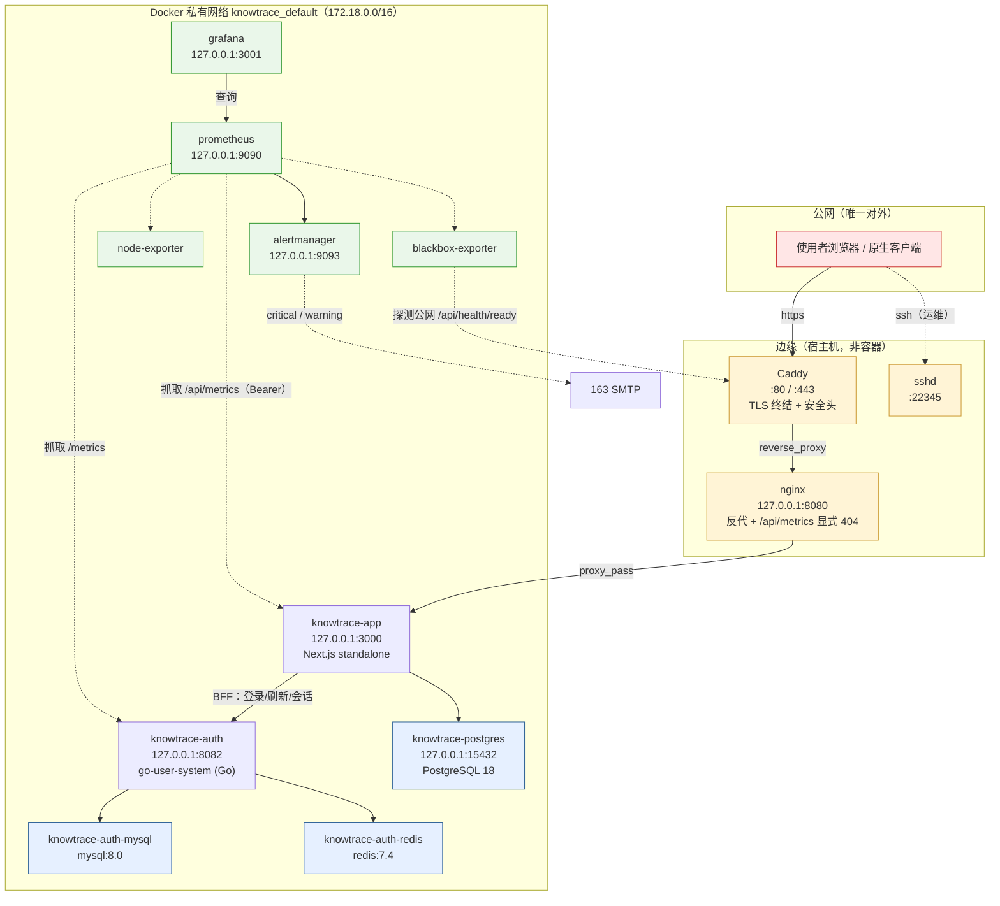
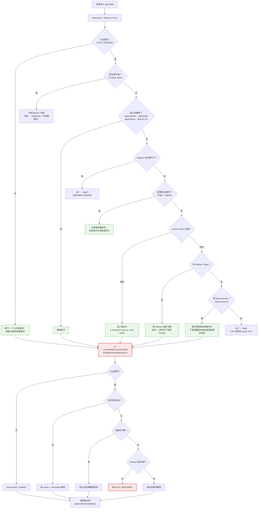
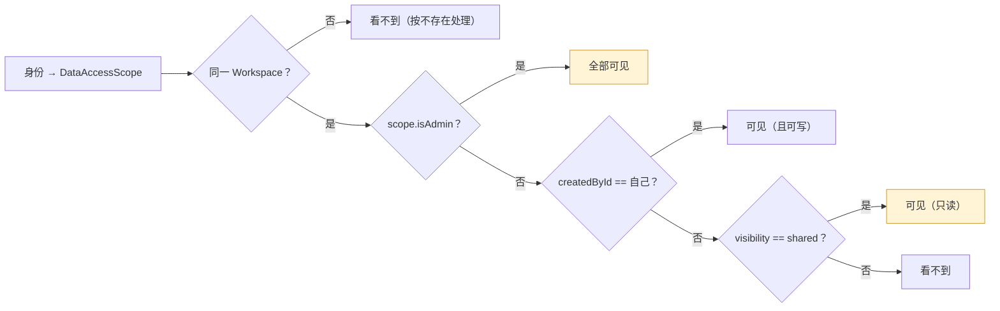
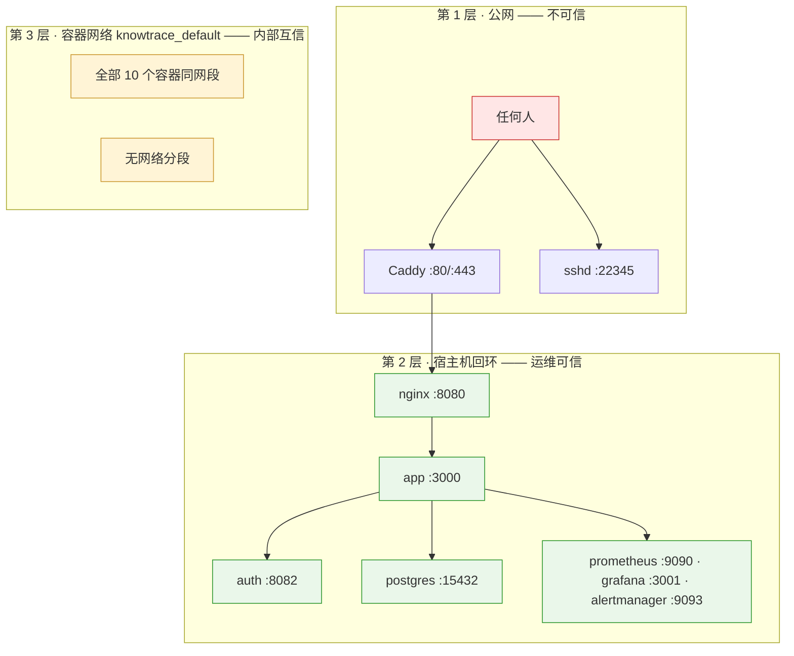
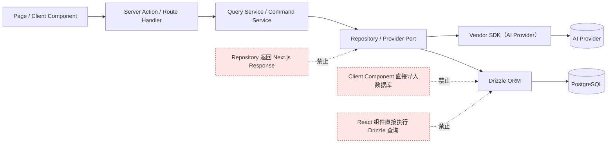
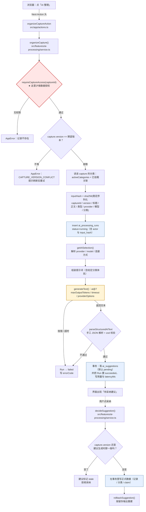
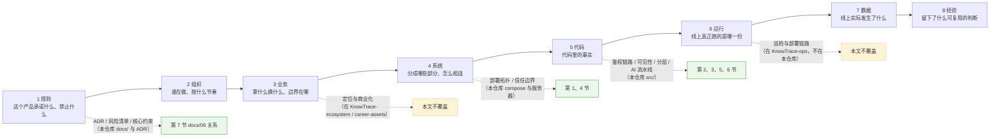

# 技术架构图

| 项 | 值 |
| --- | --- |
| 建立时间 | 2026-10-02 |
| 用途 | 补齐 `docs/06-architecture.md` 里那张 5 行流程图**覆盖不到**的整体结构（共 9 张图：部署 / 鉴权 / 可见性 / 边界 / 分层 / AI 流水线 / 生态链路） |
| 与 `docs/06` 的关系 | **不替代它**。`docs/06` 讲的是「为什么这样选」（取舍与理由），本文画的是「实际长什么样」（组件、链路、边界） |
| 领域模型 | 见 [`03-domain-model.md`](03-domain-model.md) 的 `erDiagram`，本文不重复 |
| 证据纪律 | 图里每个组件都能在服务器 `docker ps` 找到；端口与链路与 `ss -tlnp` / Caddyfile / nginx conf 一致。**本节标注了两类证据：站上实测【实测】，与引自 `KnowTrace-ecosystem` 的数字（已在第 9 节注明来源）** |

---

## 1. 部署拓扑

**读这张图要抓住三件事**：

| # | 事实 | 为什么重要 |
| --- | --- | --- |
| 1 | **只有 Caddy（80/443）与 sshd（22345）对外** | 其余全部绑 `127.0.0.1`；数据库没有对公网开放 |
| 2 | **代理是三跳**：Caddy → nginx → app | `docs/06` 的旧图完全没有这一层；限流的真实 IP 就在这条链上传递 |
| 3 | **10 个容器在同一个网络、没有分段；ELK 的 3 个在独立网络** | 见第 4 节——这是**已知的收敛点**，不是疏忽 |

---

## 2. 一次请求的鉴权链路（**安全关键路径**）

**这张图的价值在于画出了一个容易误解的事实**：

> **Proxy 不是安全边界，`currentDataAccessScope()` 才是。**

Proxy 做的是**页面前置门禁**（决定「给不给看这个页面」）；
真正的**数据授权**在每个查询里通过 `captureReadCondition(scope)` 执行。所以：

- **Proxy 放行了不等于有权限**——`STRIP` 那条路径就是例子：
  它故意放行 Server Action，但剥掉身份头，让下游**自己**判断并返回结构化错误。
- **新加一个查询而忘记带 `captureReadCondition`，没有任何东西会拦住它**——
  这是当前鉴权模型的**单点风险**（见第 8 节）。

---

## 3. 数据可见性规则（谁看得到什么）

**这张图解释了 2026-10-01 那次数据暴露事故**——不是某一条规则错了，是**三条规则叠加**：

1. 新用户自动进默认空间（`ensureLegacyWorkspaceMembership`）
2. 成员可读 `shared`（上图「可见（只读）」那条）
3. **管理员的 `private` 会被 `applyAdminSharingPolicy` 强制改回 `shared`**

⇒ **任何注册者必然能读到管理员的全部记录。** 所以「关闭注册」是唯一的零代码缓解。

---

## 4. 信任边界（三层，可信度不同）

**这张图的重点是：信任不是按网络位置划分的，是按「谁能访问」划分的。**

| 层 | 谁在里面 | 可信度怎么来的 | 实测结论 |
| --- | --- | --- | --- |
| 公网 | 任何人 | 无 | 只有 Caddy（80/443）与 sshd（22345）在监听；数据库不对公网开放 |
| 宿主机回环 | nginx / app / auth / postgres / 观测组件 | **运营商（运维）可信**，不是「本机即可信」 | 非公网端口全部绑 `127.0.0.1`，因此**必须走 SSH 隧道** |
| 容器网络 | 10 个容器在 `172.18.0.0/16` | **内部互信**（当前设计） | 见下面三个实测事实 |

**三个实测事实**（可逐条验证，不是推断）：

| 事实 | 实测 | 影响 |
| --- | --- | --- |
| 主网络无分段 | 10 个容器全部只在 `knowtrace_default` | 应用容器能直连 `postgres`、`auth-mysql`、`auth-redis` |
| 认证服务信任整个网段 | `.env` 的 `AUTH_TRUSTED_PROXIES=172.18.0.0/16` | **该网段内任何容器**都能伪造 `X-Forwarded-For`；而 app 又原样转发收到的 XFF，两者叠加即可绕过 **IP 维度**限流 |
| **但能利用的只有应用容器自身** | 认证服务容器**只接** `knowtrace_default` | 「app 转发伪造 XFF 给 auth」这条路径**到得了**，但前提是 app 已被攻破；账号维度限流（5 次）也仍然生效 |

**还有两个容易被说错的点，一并写在这里**：

1. **nginx 的守卫是有效的，而且是「覆盖」语义**：Caddy 先用
   `real_ip_header X-Forwarded-For` + `real_ip_recursive on` 把 `$remote_addr` 还原成真实客户端；
   nginx 再 `proxy_set_header X-Forwarded-For $remote_addr` —— **覆盖**，不是追加。
   外部伪造的 XFF 到不了下游。（`deploy/nginx/knowtrace-vps.conf`）
2. **ELK 并没有破掉这条边界**：它用的是**独立网络**——
   `knowtrace_logging-internal`（`172.19.0.0/16`，`internal: true`）+
   `knowtrace_logging-management`（`172.20.0.0/16`），**都不在 app 所在的 `172.18.0.0/16` 内**。
   但 ELK 的 9200 / 5000 / 5601 也绑在回环上，所以它们属于「第 2 层」的访问面，
   **不是「第 3 层」的成员**。

**若将来要收紧**：把数据库与观测栈拆到独立网络，只让 app 能到 postgres、
只让 prometheus 能到各 exporter。**那是基础设施改动，需要单独规划。**

---

## 5. 代码分层与依赖方向

`docs/06` 第 5 节已给出依赖方向与禁止项，此处只把它画出来：

实际落地时，业务规则集中在 **`src/features/*/service.ts`（10 个）**，
而不是 `docs/06` 早期规划里写的根级 `services/`——那里现在只有
subtree 引入的 Go 认证服务。**这一点正是 `AGENTS.md` 曾经写错的地方。**

---

## 6. AI 整理流水线（一次真实写入的链路）

前五张图里，第 5 张只有 8 个方块。**而线上一次「AI 整理」实际发生的事**——
包括每一步的成功与失败路径——是下面这样。这一节是那张图的展开与校正。

**读这张图要抓住五件事**：

| # | 事实 | 依据 |
| --- | --- | --- |
| 1 | **`organizeCapture` 第一步就是 `requireCaptureAccess`** | `service.ts` 方法体第一行 |
| 2 | **`inputHash` 是只写不读的**：算出来、写进 Run 行，**没有任何地方查它**；表上也没有唯一索引 | `grep inputHash` 只有计算与插入两处；`ai_processing_runs` 无 `uniqueIndex` |
| 3 | **模型调用的信任度低于代码**：`generateText` 拿到的是**文本**，靠 `parseStructuredAIText` 手工解析 JSON 再过 zod | `src/server/ai/provider.ts`；不是 `generateObject` |
| 4 | **AI 从不直接写正式数据**，只产出 `pending` 建议；采纳是第二次独立鉴权 | `decideSuggestion` 先 `requireSuggestionAccess` |
| 5 | **采纳前比对的是 `capture.version`**（不是 `inputHash`）：等待期间记录被改过，建议判 `stale` 并拒绝 | `suggestion.sourceCaptureVersion` 与 `capture.version` 对比 |

其中第 2 条是这张图最先暴露出来的：**「整理两次」不会复用任何东西**。
点两次 = 两条 Run + 两条建议。（这正是 6.1 里「没有幂等」那一条的真实成本。）

### 6.1 这张图对应的四个真实缺口

它不是「画得全」，而是**把四个已经发生或已识别的缺口标在了位置上**：

| 位置 | 缺口 | 依据 |
| --- | --- | --- |
| `SA → SVC` 之间 | **界面没有等待反馈**。7–20 秒的等待没有进度提示，诱导用户重复点击 | [`19-product-defect-inventory.md`](19-product-defect-inventory.md) D-02 残余问题 |
| `HASH` 这一行 | **没有幂等**：`inputHash` 只写不读、无唯一索引，重复点击必然产生重复 Run 与重复建议 | 上图第 2 条 |
| `RUN` 这一行 | **`/api/v1` 没有触发端点**。整理只能走 Server Action，移动端走不通，也因此无法受控测量 | D-02 残余问题（即 M1 缺口二） |
| 图外 | **`status=running` 的残留 Run 一直在**。`AI_RUNNING_STALE_AFTER_MS` 只被 `scripts/maintenance.mjs`（`npm run db:maintenance`）读取，而**没有对应的 systemd timer** | 服务器 `systemctl list-timers` 无此单元 |

**这四条都不是「图画错了」，是「图画对了才发现的位置」。**

---

## 7. 与 `docs/06` 的关系

| 文档 | 回答 |
| --- | --- |
| [`06-architecture.md`](06-architecture.md) | **为什么这样选**——取舍、理由、被否掉的方案 |
| **本文** | **实际长什么样**——组件、链路、边界、可见性 |

**`docs/06` 的 5 行流程图保留不动**（它是「架构结论」的一句话表达）；
本文是它的**展开与校正**——补上边缘代理、监控栈、Workspace 隔离，
并更正第 8 节「KnowTrace Compose 服务：app、postgres」的过时描述
（**实际 10 个容器**）。

---

## 8. 维护约定

**改以下任何一处时，回来更新对应的图**：

| 改动 | 更新哪张图 |
| --- | --- |
| 加/删容器、改端口映射 | 第 1 节 部署拓扑 |
| 改 `src/proxy.ts` 的分支 | 第 2 节 鉴权链路 |
| 改 `resource-scope.ts` 或 `applyAdminSharingPolicy` | 第 3 节 可见性规则 |
| 拆网络分段、改 `trustedProxies` | 第 4 节 信任边界 |
| 改服务层分层或依赖方向 | 第 5 节 分层 |
| 改 `organizeCapture` / `decideSuggestion` / 采纳判据 | 第 6 节 AI 流水线 |
| 改观察链路、数据来源、八环结构 | 第 9 节 生态链路 |

**这七处恰好也是本季度改动最密集的地方**——所以这张图的价值不在于「画得全」，
而在于**它是这几条链路的单一参照**，不必每次去代码里重新挖一遍。

### 一张表：图与已知缺口的对应

| 图 | 对应哪些已知问题 |
| --- | --- |
| 第 2 节 鉴权链路 | 2026-10-01 修的「会话续期从不触发」就发生在 `P5 → RENEW` 那条边 |
| 第 3 节 可见性规则 | 2026-10-01 的数据暴露事故 |
| 第 4 节 信任边界 | 2026-10-01 修的「限流按容器 IP 计数」——`trustedProxies` 那一行 |
| 第 6 节 AI 流水线 | 线上一次「较慢的 AI 整理」（`latencyMs=18550`）与它暴露的四个缺口 |

**前三张图各自对应一次真实事故**，第 6 节对应一次实测运行。这不是巧合：
**改动最密集的地方，就是最容易画错、也最需要有一张共同参照的地方。**

### 这张图什么时候会过期

第 9 节的链路不是本仓库里的东西——**本仓库的外围还有三个工作区各自独立演进**：

| 工作区 | 与本文的关系 |
| --- | --- |
| `KnowTrace`（本仓库） | 第 1–7 节的全部证据来自这里 |
| `KnowTrace-ops` | 第 6 环（运行）的载体：巡检、部署、事故复盘 |
| `KnowTrace-ecosystem` | 第 9 节的八环数字来自这里（2026-09-29 观察，非实时） |
| `KnowTrace-tech-review` / `KnowTrace-career-assets` | 与本文无直接图，但改技术栈会回溯到第 1、4 节 |

**所以本文有两次「一起过期」的风险**：本仓库改动（改图），
或其他工作区推进（第 9 节的对应关系要更新）。**这两件事不会互相提醒。**

---

## 9. 生态链路（本仓库在这一整条链上的位置）

前八张图都画在**本仓库内部**。但 `docs/06` 回答的是「为什么这样选」，
本文回答的是「实际长什么样」——**两者都只覆盖链条的中段**。

这条链是**八环传导**：每一环把上一环的意图翻译成下一环可执行的形态。
本文能画的只有其中四环，另外四环的载体根本不在这个仓库里：

**哪些环有图，哪些环没有**：

| 环 | 载体在哪儿 | 本文画了吗 |
| --- | --- | --- |
| 规则 | 本仓库 `docs/` + ADR | 部分（第 7 节交代了与 `docs/06` 的分工） |
| 组织 | 本仓库 `CONTRIBUTING.md` + git 历史 | ❌ 不是空间结构，画不出拓扑 |
| 业务 | 不在本仓库 | ❌ |
| 系统 | 本仓库 compose + 服务器 | ✅ 第 1、4 节 |
| 代码 | 本仓库 `src/` | ✅ 第 2、3、5、6 节 |
| 运行 | `KnowTrace-ops` | ❌ |
| 数据 | 本仓库 schema + 线上库 | ❌ |
| 经验 | `KnowTrace-career-assets` | ❌ |

**今天重新实测过的、属于「系统」与「运行」两环的事实**（2026-10-02）：
11 个 Compose 服务定义里有 10 个在运行（第 11 个是 `auth-bootstrap`，一次性任务，已正常退出）；
对外监听只有 Caddy 的 80/443 与 sshd 的 22345。

> **业务 / 数据 / 经验三环的数字（账号数、表行数、AI 成功率、素材条数）不在本文采证。**
> 它们引自 [`KnowTrace-ecosystem`]（2026-09-29 观察）——**那是另一份观察记录，有它自己的证据分级**。
> 本文只负责把「链路的哪一段有图、哪一段没有」标清楚，避免把两份记录混成一份。

---
