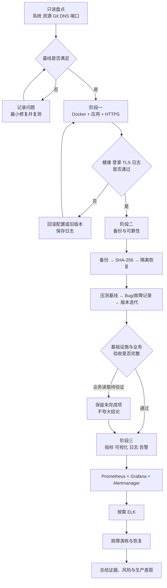
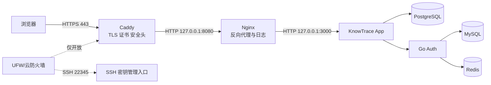
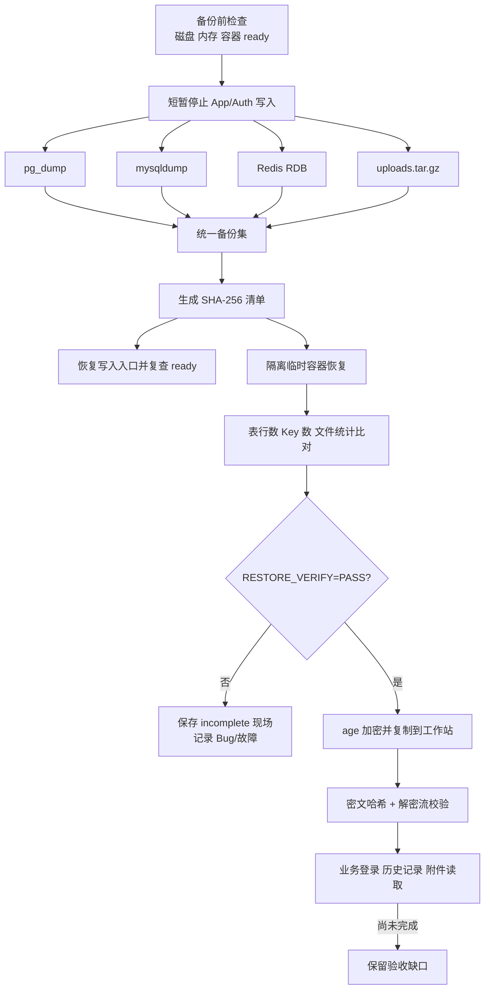
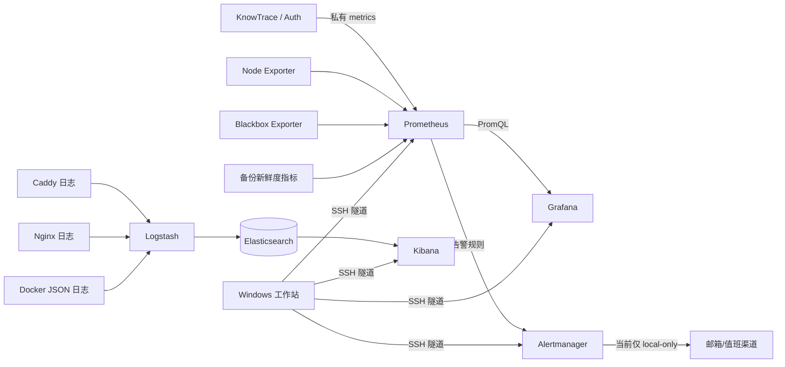
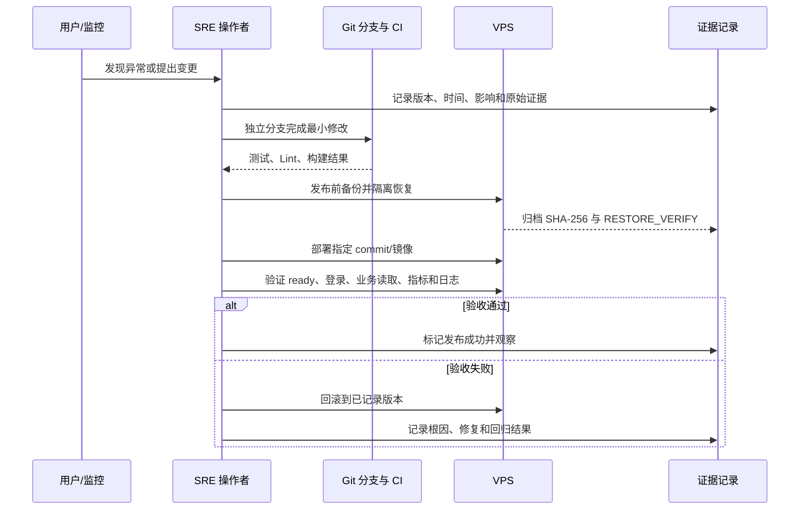

# 阶段一至三 Mermaid 执行流程

## 总体交付流程

```mermaid
flowchart TD
    A[只读盘点<br/>系统 资源 Git DNS 端口] --> B{基线是否满足}
    B -- 否 --> B1[记录问题<br/>最小修复并复测]
    B1 --> B
    B -- 是 --> C[阶段一<br/>Docker + 应用 + HTTPS]
    C --> C1{健康 登录 TLS 日志<br/>是否通过}
    C1 -- 否 --> C2[回滚配置或旧版本<br/>保存日志]
    C2 --> C
    C1 -- 是 --> D[阶段二<br/>备份与可靠性]
    D --> D1[备份 → SHA-256 → 隔离恢复]
    D1 --> D2[压测基线 → Bug/故障记录 → 版本迭代]
    D2 --> D3{基础设施与业务<br/>验收是否完整}
    D3 -- 业务读取待验证 --> D4[保留未完成项<br/>不夸大结论]
    D3 -- 通过 --> E[阶段三<br/>指标 可视化 日志 告警]
    D4 --> E
    E --> E1[Prometheus + Grafana + Alertmanager]
    E1 --> E2[按需 ELK]
    E2 --> E3[故障演练与恢复]
    E3 --> F[总结证据、风险与生产差距]
```

## 阶段一：公网请求链路

```mermaid
flowchart LR
    U[浏览器] -->|HTTPS 443| C[Caddy<br/>TLS 证书 安全头]
    C -->|HTTP 127.0.0.1:8080| N[Nginx<br/>反向代理与日志]
    N -->|HTTP 127.0.0.1:3000| A[KnowTrace App]
    A --> P[(PostgreSQL)]
    A --> H[Go Auth]
    H --> M[(MySQL)]
    H --> R[(Redis)]

    FW[UFW/云防火墙] -. 仅开放 .-> C
    FW -. SSH 22345 .-> S[SSH 密钥管理入口]
```

## 阶段二：备份与恢复证据链

```mermaid
flowchart TD
    PRE[备份前检查<br/>磁盘 内存 容器 ready] --> Q[短暂停止 App/Auth 写入]
    Q --> PG[pg_dump]
    Q --> MY[mysqldump]
    Q --> RD[Redis RDB]
    Q --> UP[uploads.tar.gz]
    PG --> PKG[统一备份集]
    MY --> PKG
    RD --> PKG
    UP --> PKG
    PKG --> HASH[生成 SHA-256 清单]
    HASH --> RES[恢复写入入口并复查 ready]
    HASH --> ISO[隔离临时容器恢复]
    ISO --> COUNT[表行数 Key 数 文件统计比对]
    COUNT --> PASS{RESTORE_VERIFY=PASS?}
    PASS -- 否 --> INC[保存 incomplete 现场<br/>记录 Bug/故障]
    PASS -- 是 --> ENC[age 加密并复制到工作站]
    ENC --> VERIFY[密文哈希 + 解密流校验]
    VERIFY --> BIZ[业务登录 历史记录 附件读取]
    BIZ -->|尚未完成| GAP[保留验收缺口]
```

## 阶段三：指标、日志和告警链路

```mermaid
flowchart LR
    APP[KnowTrace / Auth] -->|私有 metrics| PROM[Prometheus]
    NODE[Node Exporter] --> PROM
    BB[Blackbox Exporter] --> PROM
    BK[备份新鲜度指标] --> PROM
    PROM -->|PromQL| G[Grafana]
    PROM -->|告警规则| AM[Alertmanager]
    AM -->|当前仅 local-only| MAIL[邮箱/值班渠道]

    CA[Caddy 日志] --> LS[Logstash]
    NG[Nginx 日志] --> LS
    DJ[Docker JSON 日志] --> LS
    LS --> ES[(Elasticsearch)]
    ES --> K[Kibana]

    WIN[Windows 工作站] -->|SSH 隧道| G
    WIN -->|SSH 隧道| PROM
    WIN -->|SSH 隧道| AM
    WIN -->|SSH 隧道| K
```

## Bug、故障与版本迭代

```mermaid
sequenceDiagram
    participant User as 用户/监控
    participant Ops as SRE 操作者
    participant Git as Git 分支与 CI
    participant VPS as VPS
    participant Evidence as 证据记录

    User->>Ops: 发现异常或提出变更
    Ops->>Evidence: 记录版本、时间、影响和原始证据
    Ops->>Git: 独立分支完成最小修改
    Git-->>Ops: 测试、Lint、构建结果
    Ops->>VPS: 发布前备份并隔离恢复
    VPS-->>Evidence: 归档 SHA-256 与 RESTORE_VERIFY
    Ops->>VPS: 部署指定 commit/镜像
    Ops->>VPS: 验证 ready、登录、业务读取、指标和日志
    alt 验收通过
        Ops->>Evidence: 标记发布成功并观察
    else 验收失败
        Ops->>VPS: 回滚到已记录版本
        Ops->>Evidence: 记录根因、修复和回归结果
    end
```

