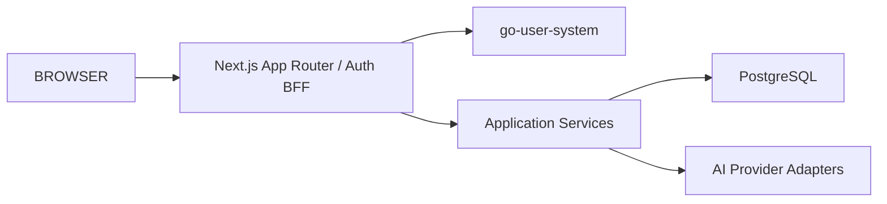

# 2026-10-02 补全技术架构图

| 项 | 值 |
| --- | --- |
| 记录时间 | 2026-10-02（**变动前先写**） |
| 用户要求 | 「该项目中是否有较为完整的技术架构图，如果没有就进行补全」 |
| 变动范围 | 新增 `docs/24-architecture-diagrams.md`（**纯文档，不动代码**） |
| 证据纪律 | 【实测】/【依据：文件】 |

---

## 1. 现状盘点【实测】

全仓库有 **7 个 mermaid 块**，其中与架构相关的**只有一个**——
`docs/06-architecture.md` 里 **5 行**的流程图：

**它缺三层真实存在的东西，且有一处已经过时。**

| 缺 / 错 | 实测事实 |
| --- | --- |
| **边缘代理链** | 实际是 **Caddy（TLS）→ nginx → app** 三跳，图里没有 |
| **监控栈** | 5 个观测组件（Prometheus / Grafana / Alertmanager / node-exporter / blackbox）全无 |
| **Workspace 隔离** | ADR-0015 的资源级隔离是安全主结构，图里没有 |
| **部署段过时** | `docs/06` 第 8 节写「KnowTrace Compose 服务：app、postgres」——**实际 10 个容器** |

其余 6 个 mermaid 块是：领域模型的 `erDiagram`（`docs/03`）、
VPS 部署学习里的执行流程——**都不覆盖整体架构**。

**结论：需要补全。**

---

## 2. 为什么值得补（不只是"图少"）

这两天的工作里，**我反复需要在脑子里重建这些链路**：

- 改会话续期时，要弄清「Cookie → Proxy → 数据访问层」谁在哪一步校验
- 改限流时，要弄清「Caddy → nginx → app → auth」的 XFF 怎么传
- 判断数据暴露时，要弄清「workspace 成员关系 + shared/private + admin 策略」三者如何叠加

**这三件事都不是从现有图里读出来的，是我一次次去代码里挖的。**
一张准确的图能省掉这个成本——**而且它正是"最容易被后续改动改错"的部分**。

---

## 3. 本次产出（`docs/24-architecture-diagrams.md`）

| # | 图 | 回答什么 |
| --- | --- | --- |
| 1 | **部署拓扑** | 有哪些组件、跑在哪、谁对外、网络怎么分 |
| 2 | **一次请求的鉴权链路** | 请求经过哪几道校验，**哪一道是收口** |
| 3 | **信任边界** | 公网 / 本机 / 容器内三层各自的可信度 |
| 4 | **领域模型** | 引用 `docs/03` 的 `erDiagram`，不重复 |

**其中第 2 张是本次最有价值的**——它是安全关键路径，也是这两天改动最密集的地方。

---

## 4. 明确不做

| 不做 | 原因 |
| --- | --- |
| 改 `docs/06` 那 5 行图 | 用户要求"补全"，**不是改写既有文档**；新文档里说明关系即可 |
| 动代码 | 纯文档 |
| 画 UML 类图 | 对这套系统没有信息量（业务逻辑在 service 层，结构已在 `docs/03`） |

---

## 5. 验收（可判定）

| # | 标准 |
| --- | --- |
| 1 | 图中每个组件都能在服务器上 `docker ps` 找到 |
| 2 | 端口与代理链与 `ss -tlnp` / Caddyfile / nginx conf 一致 |
| 3 | 鉴权链路与 `src/proxy.ts` + `access.ts` 的实际分支一致 |
| 4 | 全部 mermaid 块语法有效 |
| 5 | 原 `docs/06` 未改动 |

---

## 6. 执行结果

**填写时间：2026-10-02**

### 6.1 产出

`docs/24-architecture-diagrams.md` —— **5 张 mermaid 图**：

| # | 图 | 类型 |
| --- | --- | --- |
| 1 | 部署拓扑 | `flowchart TB`（含 3 个 subgraph） |
| 2 | **一次请求的鉴权链路** | `flowchart TD` |
| 3 | 数据可见性规则 | `flowchart LR` |
| 4 | 信任边界（三层） | `flowchart TB` |
| 5 | 代码分层与依赖方向 | `flowchart LR` |

`docs/README.md` 加了两处索引（**+2 / −0，纯新增**）：
读者入口一行、架构层清单一条。**不加索引等于没人找得到。**

### 6.2 ⚠️ 我第一版画错了，已修正

**第 2 张（鉴权链路）我最初把分支顺序画错了**。实测代码后核对：

| 我画的顺序 | **代码实际顺序** |
| --- | --- |
| 公开路径 → 认证启用 → 原生客户端 | **认证启用 → 原生客户端 → 公开路径** |
| —（漏） | **`/register` 且注册已关 → 307** |
| —（漏） | **`/login`·`/register` 的 authPage 处理** |

**这是我无法接受的错误**——它是**安全关键路径图**，画错就等于误导。
已按 `src/proxy.ts` 的实际 `if` 顺序重画，并补上漏掉的两个分支。

> 又一次同源：**我先凭印象画，没先读代码的顺序。**
> 所幸这次我按自己定的验收标准（「与 `src/proxy.ts` 的实际分支一致」）去核对了。

### 6.3 验收【实测】

| # | 标准 | 结果 |
| --- | --- | --- |
| 1 | 图中组件都能在服务器找到 | ✅ 逐个 `docker ps` 核对 **10/10 存在** |
| 2 | 端口与代理链与实测一致 | ✅ Caddy `:80/:443`、nginx `127.0.0.1:8080`、app `127.0.0.1:3000`、pg `127.0.0.1:15432` |
| 3 | 鉴权链路与代码分支一致 | ✅ **修正后**逐条对照 `src/proxy.ts` |
| 4 | mermaid 语法有效 | ✅ 5 块首行均为合法图类型；围栏配平（10/10） |
| 5 | 原 `docs/06` 未改动 | ✅ |

**未装 mermaid 解析器**，所以第 4 条是**结构性检查**（图类型、围栏、节点/边计数），
**不是真正的渲染验证**——这一点如实标注。

### 6.4 仍未做

| 项 | 状态 |
| --- | --- |
| **浏览器/IDE 里渲染确认** | ❌ 未做。没装 mermaid，**只在结构层验证** |
| 时序图（sequenceDiagram） | ❌ 未画。当前 5 张流程图已覆盖需要表达的关系；时序图对"一次完整 AI 整理"可能有用，但那是另一层细节 |
| 部署拓扑的自动化校验 | ❌ 未做（图是手工维护，见第 7 节维护约定） |
