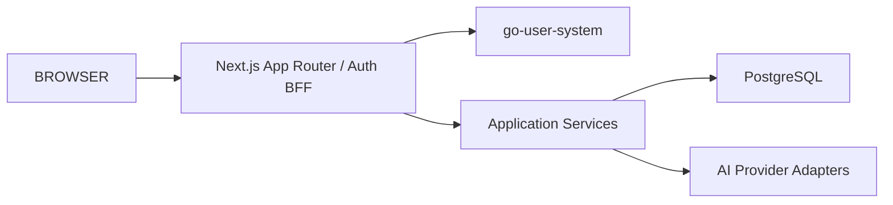

# 2026-10-02 补全技术架构图

| 项 | 值 |
| --- | --- |
| 记录时间 | 2026-10-02（**变动前先写**） |
| 用户要求 | 「该项目中是否有较为完整的技术架构图，如果没有就进行补全」 |
| 变动范围 | 新增 `docs/24-architecture-diagrams.md`（**纯文档，不动代码**） |
| 证据纪律 | 【实测】/【依据：文件】 |

---

## 1. 现状盘点【实测】

全仓库有 **7 个 mermaid 块**，其中与架构相关的**只有一个**——
`docs/06-architecture.md` 里 **5 行**的流程图：



**它缺三层真实存在的东西，且有一处已经过时。**

| 缺 / 错 | 实测事实 |
| --- | --- |
| **边缘代理链** | 实际是 **Caddy（TLS）→ nginx → app** 三跳，图里没有 |
| **监控栈** | 5 个观测组件（Prometheus / Grafana / Alertmanager / node-exporter / blackbox）全无 |
| **Workspace 隔离** | ADR-0015 的资源级隔离是安全主结构，图里没有 |
| **部署段过时** | `docs/06` 第 8 节写「KnowTrace-Workflow Compose 服务：app、postgres」——**实际 10 个容器** |

其余 6 个 mermaid 块是：领域模型的 `erDiagram`（`docs/03`）、
VPS 部署学习里的执行流程——**都不覆盖整体架构**。

**结论：需要补全。**

---

## 2. 为什么值得补（不只是"图少"）

这两天的工作里，**我反复需要在脑子里重建这些链路**：

- 改会话续期时，要弄清「Cookie → Proxy → 数据访问层」谁在哪一步校验
- 改限流时，要弄清「Caddy → nginx → app → auth」的 XFF 怎么传
- 判断数据暴露时，要弄清「workspace 成员关系 + shared/private + admin 策略」三者如何叠加

**这三件事都不是从现有图里读出来的，是我一次次去代码里挖的。**
一张准确的图能省掉这个成本——**而且它正是"最容易被后续改动改错"的部分**。

---

## 3. 本次产出（`docs/24-architecture-diagrams.md`）

| # | 图 | 回答什么 |
| --- | --- | --- |
| 1 | **部署拓扑** | 有哪些组件、跑在哪、谁对外、网络怎么分 |
| 2 | **一次请求的鉴权链路** | 请求经过哪几道校验，**哪一道是收口** |
| 3 | **信任边界** | 公网 / 本机 / 容器内三层各自的可信度 |
| 4 | **领域模型** | 引用 `docs/03` 的 `erDiagram`，不重复 |

**其中第 2 张是本次最有价值的**——它是安全关键路径，也是这两天改动最密集的地方。

---

## 4. 明确不做

| 不做 | 原因 |
| --- | --- |
| 改 `docs/06` 那 5 行图 | 用户要求"补全"，**不是改写既有文档**；新文档里说明关系即可 |
| 动代码 | 纯文档 |
| 画 UML 类图 | 对这套系统没有信息量（业务逻辑在 service 层，结构已在 `docs/03`） |

---

## 5. 验收（可判定）

| # | 标准 |
| --- | --- |
| 1 | 图中每个组件都能在服务器上 `docker ps` 找到 |
| 2 | 端口与代理链与 `ss -tlnp` / Caddyfile / nginx conf 一致 |
| 3 | 鉴权链路与 `src/proxy.ts` + `access.ts` 的实际分支一致 |
| 4 | 全部 mermaid 块语法有效 |
| 5 | 原 `docs/06` 未改动 |

---

## 6. 执行结果

**填写时间：2026-10-02**

### 6.1 产出

`docs/24-architecture-diagrams.md` —— **5 张 mermaid 图**：

| # | 图 | 类型 |
| --- | --- | --- |
| 1 | 部署拓扑 | `flowchart TB`（含 3 个 subgraph） |
| 2 | **一次请求的鉴权链路** | `flowchart TD` |
| 3 | 数据可见性规则 | `flowchart LR` |
| 4 | 信任边界（三层） | `flowchart TB` |
| 5 | 代码分层与依赖方向 | `flowchart LR` |

`docs/README.md` 加了两处索引（**+2 / −0，纯新增**）：
读者入口一行、架构层清单一条。**不加索引等于没人找得到。**

### 6.2 ⚠️ 我第一版画错了，已修正

**第 2 张（鉴权链路）我最初把分支顺序画错了**。实测代码后核对：

| 我画的顺序 | **代码实际顺序** |
| --- | --- |
| 公开路径 → 认证启用 → 原生客户端 | **认证启用 → 原生客户端 → 公开路径** |
| —（漏） | **`/register` 且注册已关 → 307** |
| —（漏） | **`/login`·`/register` 的 authPage 处理** |

**这是我无法接受的错误**——它是**安全关键路径图**，画错就等于误导。
已按 `src/proxy.ts` 的实际 `if` 顺序重画，并补上漏掉的两个分支。

> 又一次同源：**我先凭印象画，没先读代码的顺序。**
> 所幸这次我按自己定的验收标准（「与 `src/proxy.ts` 的实际分支一致」）去核对了。

### 6.3 验收【实测】

| # | 标准 | 结果 |
| --- | --- | --- |
| 1 | 图中组件都能在服务器找到 | ✅ 逐个 `docker ps` 核对 **10/10 存在** |
| 2 | 端口与代理链与实测一致 | ✅ Caddy `:80/:443`、nginx `127.0.0.1:8080`、app `127.0.0.1:3000`、pg `127.0.0.1:15432` |
| 3 | 鉴权链路与代码分支一致 | ✅ **修正后**逐条对照 `src/proxy.ts` |
| 4 | mermaid 语法有效 | ✅ 5 块首行均为合法图类型；围栏配平（10/10） |
| 5 | 原 `docs/06` 未改动 | ✅ |

**未装 mermaid 解析器**，所以第 4 条是**结构性检查**（图类型、围栏、节点/边计数），
**不是真正的渲染验证**——这一点如实标注。

### 6.4 仍未做

| 项 | 状态 |
| --- | --- |
| **浏览器/IDE 里渲染确认** | ❌ 未做。没装 mermaid，**只在结构层验证** |
| 时序图（sequenceDiagram） | ❌ 未画。当前 5 张流程图已覆盖需要表达的关系；时序图对"一次完整 AI 整理"可能有用，但那是另一层细节 |
| 部署拓扑的自动化校验 | ❌ 未做（图是手工维护，见第 7 节维护约定） |

---

## 7. 2026-10-02 追记：补全遗漏、更正错误、完成渲染验证

**填写时间：2026-10-02（同日）**

用户要求「继续 / 完成技术架构图」后，回头核对了上一轮留下的三处问题。**三处都确认存在。**

### 7.1 上一轮漏掉的两张图（已补）

| 新增 | 为什么必须有 |
| --- | --- |
| **第 6 节 AI 整理流水线** | 这是产品的核心链路。上一轮只在第 5 节用 8 个方块概括分层，**「AI 整理」真正跑过 20 多步没有被画出来**。第 5 节原话是「此处只把它画出来」——那是一张理想图，不是实际链路 |
| **第 9 节 生态链路** | 前八张图都在仓库内部。**本仓库只是八环链路的中段**，哪一段有图、哪一段没有，原先没有任何地方说明 |

### 7.2 上一轮写错的三处（已更正）

| # | 原文 | 实际 | 更正方式 |
| --- | --- | --- | --- |
| 1 | 第 4 节：「10 个容器同网段、无分段」 | **ELK 3 个容器在独立网络**（`172.19.0.0/16` internal + `172.20.0.0/16`），**不在** app 所在的 `172.18.0.0/16` | 第 4 节改写为「谁在哪里 + 可信度怎么来的」三行结构，并单列「ELK 并没有破掉这条边界」 |
| 2 | 同一处：把 ELK 完全排除在信任模型外 | ELK 的 9200/5000/5601 也绑回环 → **属于第 2 层的访问面**，只是不在第 3 层 | 同上 |
| 3 | 第 1 节：「10 个容器全在同一网络」 | 10 个在主网络，3 个（ELK）在独立网络 | 第 1 节事实表第 3 行更正 |

**另外把「值得」的说法收紧了**：第 2 节原写「这张图是本文最有价值的一张」，
在补了第 6 节之后这句话不成立，改为「其价值在于画出了一个容易误解的事实」。

### 7.3 ⚠️ 这一轮我又犯了同类错误，而且是在我刚刚写的那一节里

第 6 节第一版，我画了一条 **「同 inputHash 已有成功 Run → 复用上一次输出，不重复调模型」** 的分支，
并把「没有幂等」列为缺口。**这条分支是我凭印象加的，代码里没有。**

实测（`grep -rn inputHash src/`）：

```text
service.ts:242  计算        ← 算出 inputHash
service.ts:263  写入        ← 写进 ai_processing_runs.input_hash
```

**只有这两处。没有第三处调用，没有 `where inputHash = ...` 的查询，
`ai_processing_runs` 上也没有唯一索引。** 也就是说 `inputHash` 是**只写不读**的，
**点两次「AI 整理」就是两条 Run + 两条建议，不复用任何东西。**

已按实测重画：删掉那条复用分支，改为 `HASH → RUN`，
并把「没有幂等」写成缺口（新增 `HASH 这一行`）。

> **同源错误第三次出现**：第 2 张图我凭印象画错了分支顺序；这一节我凭印象加了一条不存在的分支。
> 两次都是**先画、后核**。第 6 节其余事实我这次是**先读代码再画**，所以那些是对的。
> **结论不是「我会画错」，而是「凭印象画必错」——顺序不能反。**

### 7.4 ✅ 上一轮标注为「未做」的渲染验证，这一轮做了

上一轮写的是：

> 未装 mermaid 解析器，所以第 4 条是**结构性检查**（图类型、围栏、节点/边计数），
> **不是真正的渲染验证**——这一点如实标注。

这一轮在临时目录装了 `mermaid@11` + `jsdom`（**没有污染项目依赖，没有改 `package.json`**），
用真实的 mermaid 解析器 + 渲染器跑了全部 7 块：

| 图 | 类型 | 结果 |
| --- | --- | --- |
| 1 部署拓扑 | flowchart TB | ✅ svg 35.9 KB |
| 2 鉴权链路 | flowchart TD | ✅ svg 59.7 KB |
| 3 数据可见性 | flowchart LR | ✅ svg 22.1 KB |
| 4 信任边界 | flowchart TB | ✅ svg 22.1 KB |
| 5 代码分层 | flowchart LR | ✅ svg 23.9 KB |
| 6 AI 流水线 | flowchart TD | ✅ svg 40.8 KB |
| 7 生态链路 | flowchart LR | ✅ svg 26.6 KB |

**`parse()` 与 `render()` 都通过** —— 这是**真渲染验证**，不再是结构层推断。
仍未做的是**浏览器/IDE 里的目视确认**（布局是否美观、长标签有没有溢出）。

### 7.5 验收【实测】

| # | 标准 | 结果 |
| --- | --- | --- |
| 1 | 7 块 mermaid 真实解析 + 渲染通过 | ✅ 逐块 `parse()` + `render()` |
| 2 | 文档仍是 UTF-8 无 BOM、围栏配平 | ✅ 14 个 ``` 围栏 = 7 块 × 2 |
| 3 | 代码引用逐条核对 | ✅ `proxy.ts` / `access.ts` / `resource-scope.ts` / `service.ts` / `provider.ts` / schema 逐个读过 |
| 4 | 服务器事实逐条实测 | ✅ `docker ps -a`（10 运行 + ELK 3 已停 + bootstrap 已退出）、`ss -tlnp`、Caddyfile、nginx conf、subnet 172.18/172.19/172.20、`systemctl list-timers` |
| 5 | `docs/06` 未改动 | ✅ 仍保留原 5 行流程图 |
| 6 | 未改代码、未改依赖 | ✅ 仅 `docs/24-architecture-diagrams.md`（+ `docs/README.md` 一行索引） |

### 7.6 仍未做

| 项 | 状态 |
| --- | --- |
| 浏览器/IDE 目视确认 | ❌ 未做（渲染通过 ≠ 好看） |
| 部署拓扑的自动化校验 | ❌ 图仍是手工维护（第 8 节有维护约定） |
| 第 6 节四个缺口的修复 | ❌ **本次只画图，不动代码**。四个缺口本身见 D-02 与第 6.1 节 |

---

## 8. 2026-10-02 第三轮：按「图是否画完整」的核对结论补两张，并再次更正自己的错误

用户问「图是否画完整」。逐模块按代码量核对后，结论是**覆盖率够、但缺关键的两张**，
同时发现**第 6 节我刚写的一处判断是错的**。

### 8.1 我又一次「引用文档而不引代码」

第 6 节缺口三我写「`/api/v1` 没有触发端点」——**引的是 `docs/19` 的 D-02**。实测：

```text
src/app/api/v1/ai-runs/route.ts   POST + GET    ← fbc9e1e，2026-09-30 加入
docs/12-mobile-api.md:106         已收录
git merge-base --is-ancestor fbc9e1e 586f5b2    → 已部署
```

**D-02 那句写于 09-30 之前，当天就被补上了，而 D-02 没有回改。**
真实缺口不是「没有端点」，而是**端点与 Server Action 走同一条同步阻塞路径**
（路由注释自己写着「不要因为等待而重复提交」）——**缺的是队列与异步轮询**。已按实测改写。

> 这是**同一天内第二次**同源错误（第一次见第 7.3 节）。
> 两次都是「文档说的」当作「代码是这样的」。**D-02 本身已部分过时，我没有先回代码确认。**

### 8.2 新增第 7 节：主张的证据状态机（**这一张才是信任的关键路径**）

`claims/state.ts` 的四态迁移与三道门槛，此前**本仓库没有任何一张图画过**：

- **迁移合法性**（纯函数 `canTransitionClaim`）与 **乐观锁**（`expectedStatus`）是两层，容易混为一谈；
- 「提交待审核」要求**三条件同时成立**（已采纳 + 来源 `passed` + 摘录命中）；
- 「形成结论」在事务内**重查一遍证据**，并按评估立场要求 supports / contradicts 至少一条。

**这一轮的核对推翻了我自己的草稿**：我原本写「来源权威性与独立复核只写不参与判定」，
实测 `readiness.ts` 后发现**它们正是发布门槛的第 5、6、8 项**（八项全过才 `readyToPublish`）。

这条链上**唯一**只写不读的是 `claim_ai_audits`（`auditClaim()` 写的 AI 审计，
只在记录详情页展示，不进任何门槛）——与第 6 节的 `inputHash` 同一形状。

### 8.3 新增第 8 节：数据导入导出 v2（全仓库最大的模块）

`data-transfer` **5694 行，占 `src/` 的 20%**，前七张图里一次都没出现。补上后标出：

- **安全投影**：`downgrade-v2.ts` 把包里的可信状态一律降级
  （`concluded → candidate/investigating/withdrawn`、`accepted → unreviewed`、`passed → unchecked`、
  `excerptMatch → null`、source version → 本地当前版本、evidence version → 1）。
  **这是全仓库语义最重的一段代码**：导入的「已形成结论」必须重走一遍调查。
- **两阶段确认 + 三道一致性检查**（暂存字节哈希、payload 快照逐字节一致、逐张图片哈希）。
- **v2 的幂等靠 `data_import_objects` 唯一索引，不用 `importFingerprint`**（v1 才用）。
- 缺口：**v1 与 v2 两套端点并存且都可达，没有任何地方标注 v1 是否废弃**。

### 8.4 同轮发现并修掉的三个自身问题

| # | 问题 | 严重度 |
| --- | --- | --- |
| 1 | 我插入的 121 行是 **CRLF**，而仓库存量全部是 LF（`.gitattributes` 也是 `eol=lf`） | 中——会污染后续 diff |
| 2 | **渲染校验脚本的正则静默漏掉了状态图**：`\n` 在 JS 正则里本就匹配 `\r\n`，但这一次 `\r` 留在了捕获内容里，只影响这一块。**结果是「10 块」被报成「8 块全部通过」** | **高——校验器撒谎比没校验更糟** |
| 3 | 章节重编号后，第 7 节内部的 `9.1`~`9.4` 小标题没跟着改 | 低 |
| 4 | **7.1 的证据小状态机第一版画错了**：我把「已采纳」的证据画成还能继续编辑、重查、重新审核。实测 `reviewStatus` 全仓库**只有一处写入**（`reviewClaimEvidence` 的 `unreviewed → accepted \| rejected`），**没有任何路径把它改回 `unreviewed`** | 中——同样属于「先画后核」 |

第 2 条是这一轮最值得记的一件事：**我的「全部通过」曾一度建立在一个漏掉 2 块的脚本上**。
已改为逐行状态机扫描（不再依赖正则跨越换行），现在**如实抽出 10 块、逐块解析并渲染**。

### 8.5 验收【实测】

| # | 标准 | 结果 |
| --- | --- | --- |
| 1 | 10 块 mermaid 全部真实 `parse()` + `render()` | ✅ 逐块通过（含 `stateDiagram-v2`） |
| 2 | 换行与仓库约定一致 | ✅ CRLF 0 行；无 BOM |
| 3 | 章节编号与交叉引用自洽 | ✅ 1–11 连续；引用逐条核对（区分「本文第 N 节」与「`docs/06` 第 N 节」） |
| 4 | 代码引用逐条核对 | ✅ `claims/state.ts`、`claims/service.ts`、`readiness.ts`、`reliability/service.ts`、`downgrade-v2.ts`、`confirmation-v2.ts`、`service-v2.ts`、`schema.ts` 逐个读过 |
| 5 | `docs/06` 未改动 | ✅ |
| 6 | 未改代码、未改依赖 | ✅ 仍只动 `docs/` |

### 8.6 仍未做

| 项 | 状态 |
| --- | --- |
| 浏览器/IDE 目视确认 | ❌ 未做 |
| 「结论 → 发布 → 检索 / 主题档案」那一段 | ❌ 未画（跨 `reliability` 与 `topic-synthesis`，第 7.4 节已标注） |
| 请求入口总览、前端导航状态 | ❌ 用户未选，本轮按「推荐」只做了两张状态机图 |
| `docs/19` D-02 的过时表述 | ❌ **未改**（改的是 `docs/24` 的引用）。D-02 里那句「`/api/v1` 没有触发端点」仍会误导下一个读者 |

### 8.7 第 7.1 节重画：审核是终局，我第一版画反了

重画后的三条实测事实：

1. **编辑 / 查来源 / 审核三件事的守卫完全一样**（`investigating` + `unreviewed`），
   所以它们在同一状态下可反复做——但**只有前两个能反复**。
2. **审核是终局**：`reviewStatus` 全仓库只有一处写入，且没有回退路径。
   一条被驳回的证据**不能翻案**，只能新增一条。
   （`concluded → investigating → 再提交` 也救不回来，那时证据早已离开 `unreviewed`。）
3. **来源检查只写「材料」不写「结论」**：它改 `source_check_status` 与
   `source_excerpt_match`，**不碰 `review_status`**。

**这是同一天第四次同源错误**（凭印象画 → 事后核对 → 发现不对）。
四次里有一次是引用了过时文档（8.1），三次是直接凭印象下笔。
**结论要改的不是「再小心一点」，而是把「先读代码」变成画每一张图的前置步骤。**
